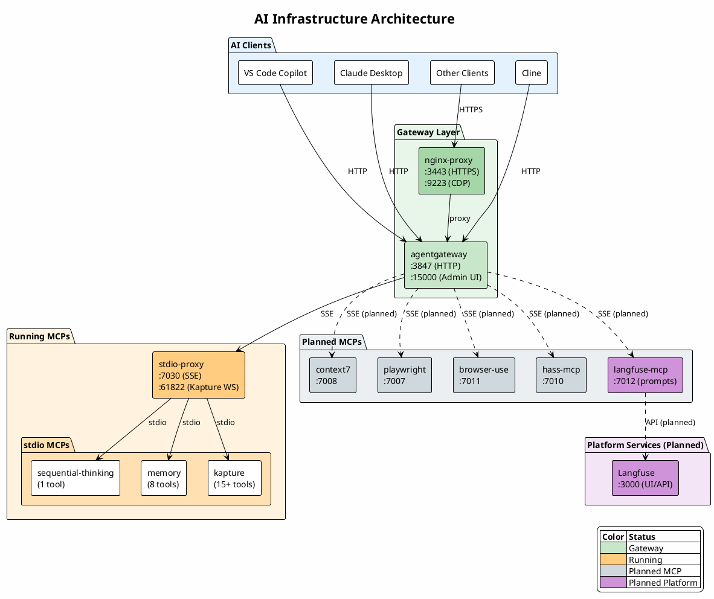

# AI Infrastructure

Central infrastructure for AI tools, MCP servers, gateways, and platform services.

## Architecture



## Current Status

| Component | Status | Tools |
| --------- | ------ | ----- |
| agentgateway | ✅ Running | - |
| sequential-thinking | ✅ Running | 1 |
| memory | ✅ Running | 8 |
| kapture | ✅ Configured | 15+ |
| **Total** | | **24+ tools** |

## Network Architecture

```text
┌─────────────────────────────────────────────────────────────────────┐
│ HOST                                                                │
│                                                                     │
│   Chrome ─────────────────────────┐                                 │
│     ├─ Kapture Extension ─────────┼─── ws://localhost:61822 ────┐   │
│     └─ DevTools (:9222) ◄─────────┼─── (CDP from containers) ◄──┼─┐ │
│                                   │                             │ │ │
│   AI Clients ─────────────────────┼─── http://localhost:3847 ───┼─┼─┤
│                                   │                             │ │ │
└───────────────────────────────────┼─────────────────────────────┼─┼─┘
                                    │                             │ │
┌───────────────────────────────────┼─────────────────────────────┼─┼─┐
│ DOCKER                            │                             │ │ │
│                                   ▼                             │ │ │
│   ┌─────────────────────────────────────────────────────────┐   │ │ │
│   │ stdio-proxy                                             │   │ │ │
│   │   :7030 (SSE) ◄── agentgateway                          │◄──┘ │ │
│   │   :61822 (WS) ◄── Kapture extension connects here       │     │ │
│   └─────────────────────────────────────────────────────────┘     │ │
│                                                                   │ │
│   ┌─────────────────────────────────────────────────────────┐     │ │
│   │ agentgateway :3847 ◄──────────────────────────────────────────┘ │
│   └─────────────────────────────────────────────────────────┘       │
│                                                                     │
│   ┌─────────────────────────────────────────────────────────┐       │
│   │ nginx-proxy                                             │       │
│   │   :9223 ──► host.docker.internal:9222 (CDP to Chrome) ──────────┘
│   │   :3443 ──► agentgateway:3847 (HTTPS termination)       │
│   └─────────────────────────────────────────────────────────┘
└─────────────────────────────────────────────────────────────────────┘

Connection directions:
  ──►  Outbound (container → host) - needs proxy
  ◄──  Inbound (host → container) - direct port exposure
```

## Directory Structure

```text
ai-infrastructure/
├── clients/           # AI client configurations
│   ├── claude/        # Claude Desktop config
│   ├── cline/         # Cline config
│   └── copilot/       # VS Code Copilot config
├── gateways/          # MCP gateways
│   └── agentgateway/  # Linux Foundation MCP gateway
├── mcps/              # MCP servers
│   ├── browser-use/   # Browser automation (planned)
│   ├── context7/      # Context7 (planned)
│   ├── hass-mcp/      # Home Assistant (planned)
│   ├── kapture/       # Chrome extension MCP (planned)
│   ├── mcpx/          # MCPX gateway (alternative)
│   ├── memory/        # Memory/knowledge graph
│   ├── playwright/    # Playwright browser automation
│   ├── sequential-thinking/ # Chain of thought reasoning
│   └── stdio-proxy/   # stdio→SSE bridge
├── services/          # Platform services
│   └── langfuse/      # LLM observability & prompts (planned)
└── workflows/         # Custom workflow definitions
```

## Components

### Gateways

| Gateway | Description | Status |
| ------- | ----------- | ------ |
| [agentgateway](gateways/agentgateway/readme.md) | Linux Foundation MCP gateway with auth, RBAC, rate limiting | ✅ Running |

### MCP Servers

| MCP | Description | Status | Docs |
| --- | ----------- | ------ | ---- |
| [sequential-thinking](mcps/sequential-thinking/readme.md) | Chain of thought reasoning | ✅ Running | [→](mcps/sequential-thinking/readme.md) |
| [memory](mcps/memory/readme.md) | Knowledge graph & memory | ✅ Running | [→](mcps/memory/readme.md) |
| [stdio-proxy](mcps/stdio-proxy/readme.md) | stdio→SSE bridge (mcp-proxy) | ✅ Running | [→](mcps/stdio-proxy/readme.md) |
| [playwright](mcps/playwright/readme.md) | Browser automation | ⏳ Planned | [→](mcps/playwright/readme.md) |
| [kapture](mcps/kapture/readme.md) | Chrome extension MCP | ⏳ Planned | [→](mcps/kapture/readme.md) |
| browser-use | AI browser automation | ⏳ Planned | - |
| context7 | Context7 library docs | ⏳ Planned | - |
| hass-mcp | Home Assistant | ⏳ Planned | - |

### Platform Services

| Service | Description | Status | Docs |
| ------- | ----------- | ------ | ---- |
| [Langfuse](services/langfuse/readme.md) | LLM observability, prompts, evals | ⏳ Planned | [→](services/langfuse/readme.md) |

### Clients

See [clients/readme.md](clients/readme.md) for configuration.

| Client | Config |
| ------ | ------ |
| VS Code Copilot | [copilot/](clients/copilot/) |
| Claude Desktop | [claude/](clients/claude/) |
| Cline | [cline/](clients/cline/) |

## Quick Start

### 1. Create Docker network

```bash
docker network create mcpx_ai-infrastructure
```

### 2. Start stdio-proxy (for stdio-based MCPs)

```bash
cd mcps/stdio-proxy
docker-compose up -d
```

### 3. Start agentgateway

```bash
cd gateways/agentgateway
docker-compose up -d
```

### 4. Access

- **MCP Endpoint**: `http://localhost:3847/mcp`
- **Admin UI**: `http://localhost:15001/ui`

### 5. Configure your AI client

See [clients/](clients/) for configuration examples for each AI client.

## Ports

| Port | Service | Protocol |
| ---- | ------- | -------- |
| 3847 | agentgateway MCP | HTTP |
| 15001 | agentgateway Admin UI | HTTP |
| 3443 | agentgateway MCP (SSL) | HTTPS |
| 7030 | stdio-proxy | SSE |
| 61822 | Kapture WebSocket | WebSocket |
| 3000 | Langfuse (planned) | HTTP |

## TODO

- [ ] Evaluate using agentgateway's native TLS instead of nginx-proxy for HTTPS termination
- [ ] Keep nginx-proxy for CDP proxy (9223) - needed for Playwright/browser-use MCPs to connect to host Chrome

## Resources

- [Model Context Protocol](https://modelcontextprotocol.io/docs/getting-started/intro)
- [agentgateway](https://agentgateway.dev/docs/)
- [Langfuse](https://langfuse.com/docs)

