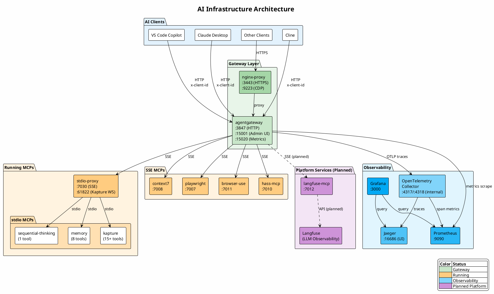
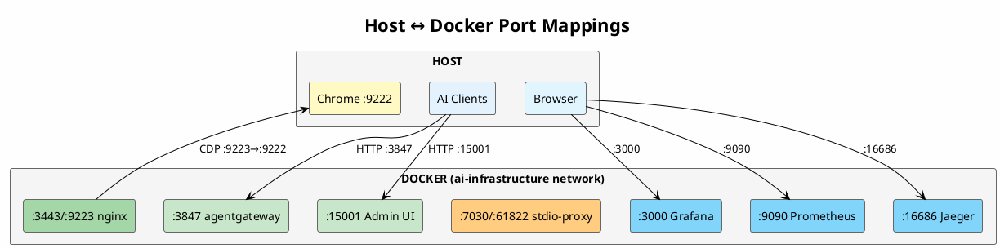

# AI Infrastructure

Central infrastructure for AI tools, MCP servers, gateways, and platform services.

## Architecture



## Current Status

| Component | Status | Tools |
| --------- | ------ | ----- |
| agentgateway | ✅ Running | - |
| sequential-thinking | ✅ Running | 1 |
| memory | ✅ Running | 8 |
| kapture | ✅ Running | 15+ |
| context7 | ✅ Running | 2 |
| playwright | ✅ Running | 15+ |
| browser-use | ✅ Running | 10+ |
| hass-mcp | ✅ Running | 5+ |
| **Total** | | **56+ tools** |

## Network Architecture



**Internal Docker Network (ai-infrastructure):**

| From | To | Port | Purpose |
| ---- | -- | ---- | ------- |
| agentgateway | stdio-proxy | 7030 | SSE to stdio MCPs |
| agentgateway | otel-collector | 4317 | OTLP traces |
| otel-collector | jaeger | 14317 | Trace export |
| otel-collector | (self) | 8889 | Span metrics |
| prometheus | agentgateway | 15020 | Metrics scrape |
| prometheus | otel-collector | 8889 | Span metrics scrape |
| grafana | prometheus | 9090 | Metrics queries |
| grafana | jaeger | 16686 | Trace queries |

## Directory Structure

```text
ai-infrastructure/
├── clients/           # AI client configurations
│   ├── claude/        # Claude Desktop config
│   ├── cline/         # Cline config
│   └── copilot/       # VS Code Copilot config
├── gateways/          # MCP gateways
│   └── agentgateway/  # Linux Foundation MCP gateway
├── mcps/              # MCP servers
│   ├── browser-use/   # AI browser automation
│   ├── context7/      # Library documentation
│   ├── hass-mcp/      # Home Assistant
│   ├── kapture/       # Chrome extension MCP
│   ├── mcpx/          # MCPX gateway (alternative)
│   ├── memory/        # Memory/knowledge graph
│   ├── playwright/    # Playwright browser automation
│   ├── sequential-thinking/ # Chain of thought reasoning
│   └── stdio-proxy/   # stdio→SSE bridge
├── services/          # Platform services
│   ├── langfuse/      # LLM observability & prompts (planned)
│   └── observability/ # Prometheus, Grafana, Jaeger
└── workflows/         # Custom workflow definitions
```

## Components

### Gateways

| Gateway | Description | Status |
| ------- | ----------- | ------ |
| [agentgateway](gateways/agentgateway/readme.md) | Linux Foundation MCP gateway with auth, RBAC, rate limiting | ✅ Running |

### MCP Servers

| MCP | Description | Status | Docs |
| --- | ----------- | ------ | ---- |
| [sequential-thinking](mcps/sequential-thinking/readme.md) | Chain of thought reasoning | ✅ Running | [→](mcps/sequential-thinking/readme.md) |
| [memory](mcps/memory/readme.md) | Knowledge graph & memory | ✅ Running | [→](mcps/memory/readme.md) |
| [stdio-proxy](mcps/stdio-proxy/readme.md) | stdio→SSE bridge (mcp-proxy) | ✅ Running | [→](mcps/stdio-proxy/readme.md) |
| [kapture](mcps/kapture/readme.md) | Chrome extension MCP | ✅ Running | [→](mcps/kapture/readme.md) |
| [playwright](mcps/playwright/readme.md) | Browser automation | ✅ Running | [→](mcps/playwright/readme.md) |
| [browser-use](mcps/browser-use/readme.md) | AI browser automation | ✅ Running | [→](mcps/browser-use/readme.md) |
| [context7](mcps/context7/readme.md) | Context7 library docs | ✅ Running | [→](mcps/context7/readme.md) |
| [hass-mcp](mcps/hass-mcp/readme.md) | Home Assistant | ✅ Running | [→](mcps/hass-mcp/readme.md) |

### Platform Services

| Service | Description | Status | Docs |
| ------- | ----------- | ------ | ---- |
| [Observability](services/observability/readme.md) | Prometheus, Grafana, Jaeger | ✅ Running | [→](services/observability/readme.md) |
| [Langfuse](services/langfuse/readme.md) | LLM observability, prompts, evals | ⏳ Planned | [→](services/langfuse/readme.md) |

### Clients

See [clients/readme.md](clients/readme.md) for configuration.

| Client | Config |
| ------ | ------ |
| VS Code Copilot | [copilot/](clients/copilot/) |
| Claude Desktop | [claude/](clients/claude/) |
| Cline | [cline/](clients/cline/) |

## Quick Start

### 1. Create Docker network

```bash
docker network create mcpx_ai-infrastructure
```

### 2. Start stdio-proxy (for stdio-based MCPs)

```bash
cd mcps/stdio-proxy
docker-compose up -d
```

### 3. Start agentgateway

```bash
cd gateways/agentgateway
docker-compose up -d
```

### 4. Start observability stack (optional)

```bash
cd services/observability
docker-compose up -d
```

### 5. Access

- **MCP Endpoint**: `http://localhost:3847/mcp`
- **Admin UI**: `http://localhost:15001/ui`
- **Grafana**: `http://localhost:3000` (admin/admin)

### 6. Configure your AI client

See [clients/](clients/) for configuration examples for each AI client.

## Ports

| Port | Service | Protocol | Notes |
| ---- | ------- | -------- | ----- |
| 3847 | agentgateway MCP | HTTP | Main MCP endpoint |
| 15001 | agentgateway Admin UI | HTTP | Playground & config |
| 15020 | agentgateway Metrics | Prometheus | Scraped by Prometheus |
| 3443 | nginx-proxy HTTPS | HTTPS | TLS termination |
| 9223 | nginx-proxy CDP | CDP | Proxies to host Chrome :9222 |
| 7030 | stdio-proxy | SSE | Bridges stdio MCPs |
| 61822 | Kapture WebSocket | WebSocket | Chrome extension |
| 16686 | Jaeger UI | HTTP | Trace visualization |
| 9090 | Prometheus | HTTP | Metrics UI & API |
| 3000 | Grafana | HTTP | Dashboards (admin/admin) |
| 4317/4318 | OTel Collector | gRPC/HTTP | Internal only (Docker network) |
| 8889 | OTel Collector Metrics | Prometheus | Span metrics (internal) |

## Observability

The observability stack provides metrics, tracing, and visualization:

| Component | Port | Purpose |
| --------- | ---- | ------- |
| agentgateway Admin UI | [:15001](http://localhost:15001/ui) | Admin UI with playground |
| agentgateway Metrics | [:15020](http://localhost:15020/metrics) | Prometheus metrics endpoint |
| Prometheus | [:9090](http://localhost:9090) | Metrics storage and queries |
| Grafana | [:3000](http://localhost:3000) | Dashboards (admin/admin) |
| Jaeger | [:16686](http://localhost:16686) | Distributed tracing |
| OpenTelemetry Collector | :4317/:4318 (internal) | Trace processing & span metrics |

**Trace Flow:**

```text
agentgateway → OTel Collector → Jaeger (traces)
                             → Prometheus (span metrics)
```

**Metrics include:**

- `agentgateway_requests_total` - HTTP requests by client, method, status
- `agentgateway_mcp_requests` - MCP tool calls
- `tool_calls_total` - Tool calls by server and tool name
- `list_calls_total` - List operations
- Span-derived metrics (latency histograms, call counts) from OTel Collector

## TODO

- [ ] Evaluate using agentgateway's native TLS instead of nginx-proxy for HTTPS termination
- [ ] Keep nginx-proxy for CDP proxy (9223) - needed for Playwright/browser-use MCPs to connect to host Chrome
- [x] Add client identification headers for per-client tracking
- [x] Set up Jaeger for distributed tracing
- [x] Configure agentgateway to send traces to OpenTelemetry Collector
- [x] Create Grafana dashboard for metrics visualization
- [ ] Set up Langfuse for LLM observability and prompt management
- [ ] Configure Playwright MCP with CDP proxy

## Resources

- [Model Context Protocol](https://modelcontextprotocol.io/docs/getting-started/intro)
- [agentgateway](https://agentgateway.dev/docs/)
- [agentgateway Observability](https://agentgateway.dev/docs/reference/observability/metrics/)
- [Langfuse](https://langfuse.com/docs)

