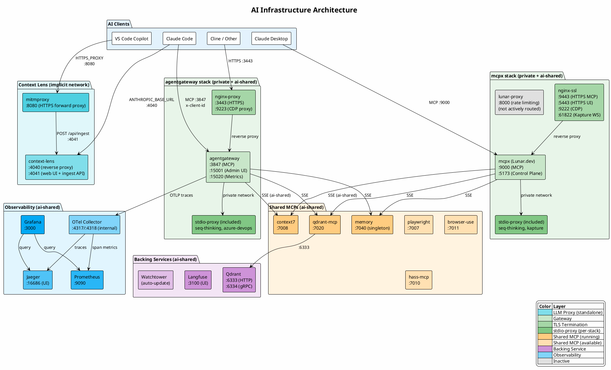

# AI Infrastructure

Central infrastructure for AI tools, MCP servers, gateways, and platform services.

## TODO

- [ ] Create an `ai-infrastructure` skill (in `~/AI/skills/` or in this repo) that documents all services, ports, startup commands, and dependencies so AI agents know what infrastructure is available when setting up machines or debugging connectivity issues.

## Architecture


```plantuml
@startuml ai-infrastructure
!theme plain
skinparam backgroundColor #FEFEFE
skinparam componentStyle rectangle
skinparam defaultFontName Consolas

title AI Infrastructure Architecture

' === AI Clients ===
package "AI Clients" as clients #E3F2FD {
  [Claude Code] as claude_code
  [VS Code Copilot] as vscode
  [Claude Desktop] as claude
  [Cline / Other] as other
}

' === LLM Proxy (standalone, implicit default network) ===
package "Context Lens (implicit network)" as cl_stack #E0F7FA {
  component "context-lens\n:4040 (reverse proxy)\n:4041 (web UI + ingest API)" as context_lens #80DEEA
  component "mitmproxy\n:8080 (HTTPS forward proxy)" as mitmproxy #4DD0E1
}

' === Gateway Stacks (each has private default + ai-shared) ===
package "agentgateway stack (private + ai-shared)" as ag_stack #E8F5E9 {
  component "agentgateway\n:3847 (MCP)\n:15001 (Admin UI)\n:15020 (Metrics)" as agentgateway #C8E6C9
  component "nginx-proxy\n:3443 (HTTPS)\n:9223 (CDP proxy)" as ag_nginx #A5D6A7
  component "stdio-proxy (included)\nseq-thinking, azure-devops" as ag_stdio #81C784
}

package "mcpx stack (private + ai-shared)" as mcpx_stack #E8F5E9 {
  component "mcpx (Lunar.dev)\n:9000 (MCP)\n:5173 (Control Plane)" as mcpx #C8E6C9
  component "nginx-ssl\n:9443 (HTTPS MCP)\n:5443 (HTTPS UI)\n:9222 (CDP)\n:61822 (Kapture WS)" as mcpx_nginx #A5D6A7
  component "stdio-proxy (included)\nseq-thinking, kapture" as mcpx_stdio #81C784
  component "lunar-proxy\n:8000 (rate limiting)\n(not actively routed)" as lunar #E0E0E0
}

' === Shared MCPs (ai-shared network) ===
package "Shared MCPs (ai-shared)" as shared_mcps #FFF3E0 {
  [context7\n:7008] as context7 #FFCC80
  [qdrant-mcp\n:7020] as qdrant_mcp #FFCC80
  [memory\n:7040 (singleton)] as memory #FFCC80
  [playwright\n:7007] as playwright #FFE0B2
  [browser-use\n:7011] as browser_use #FFE0B2
  [hass-mcp\n:7010] as hass_mcp #FFE0B2
}

' === Backing Services ===
package "Backing Services (ai-shared)" as backing #F3E5F5 {
  [Qdrant\n:6333 (HTTP)\n:6334 (gRPC)] as qdrant #CE93D8
  [Langfuse\n:3100 (UI)] as langfuse #CE93D8
  [Watchtower\n(auto-update)] as watchtower #E1BEE7
}

' === Observability ===
package "Observability (ai-shared)" as observability #E1F5FE {
  component "OTel Collector\n:4317/:4318 (internal)" as otel #81D4FA
  component "Jaeger\n:16686 (UI)" as jaeger #4FC3F7
  component "Prometheus\n:9090" as prometheus #29B6F6
  component "Grafana\n:3000" as grafana #03A9F4
}

' === Connections ===
' Clients to Context Lens
claude_code --> context_lens : ANTHROPIC_BASE_URL\n:4040
vscode --> mitmproxy : HTTPS_PROXY\n:8080
mitmproxy --> context_lens : POST /api/ingest\n:4041

' Clients to Gateways
claude_code --> agentgateway : MCP :3847\nx-client-id
claude --> mcpx : MCP :9000
other --> ag_nginx : HTTPS :3443

' TLS proxies
ag_nginx --> agentgateway : reverse proxy
mcpx_nginx --> mcpx : reverse proxy

' Gateways to private stdio-proxies
agentgateway --> ag_stdio : private network
mcpx --> mcpx_stdio : private network

' Gateways to shared MCPs (via ai-shared)
agentgateway --> context7 : SSE (ai-shared)
agentgateway --> qdrant_mcp : SSE
agentgateway --> memory : SSE
mcpx --> context7 : SSE (ai-shared)
mcpx --> qdrant_mcp : SSE
mcpx --> memory : SSE

' Backing
qdrant_mcp --> qdrant : :6333

' Observability
agentgateway --> otel : OTLP traces
otel --> jaeger : traces
otel --> prometheus : span metrics
grafana --> prometheus : query
grafana --> jaeger : query

' Legend
legend right
  |= Color |= Layer |
  | <#80DEEA> | LLM Proxy (standalone) |
  | <#C8E6C9> | Gateway |
  | <#A5D6A7> | TLS Termination |
  | <#81C784> | stdio-proxy (per-stack) |
  | <#FFCC80> | Shared MCP (running) |
  | <#FFE0B2> | Shared MCP (available) |
  | <#CE93D8> | Backing Service |
  | <#81D4FA> | Observability |
  | <#E0E0E0> | Inactive |
endlegend

@enduml
```

## Current Status

### Compose Stacks

Each stack is a self-contained `docker compose` unit. Stacks with a stdio-proxy include it from the shared template (`mcps/stdio-proxy/`) — each gets its own instance on a private network to avoid DNS collisions.

**agentgateway** (`gateways/agentgateway/`) — Linux Foundation MCP gateway

| Service | What it does | Host Ports |
| ------- | ------------ | ---------- |
| agentgateway | Routes MCP requests to 10+ backends; CORS, stateless SSE mode | :3847 (MCP), :15001 (Admin UI), :15020 (Metrics) |
| nginx-proxy | TLS termination for agentgateway; reverse-proxies `/mcp` and `/sse`; proxies Chrome DevTools Protocol from :9223 → host :9222 | :3443 (HTTPS MCP), :15443 (HTTPS Admin), :9223 (CDP) |
| stdio-proxy | Bridges stdio MCPs: sequential-thinking, azure-devops | (internal :7030) |
| mcp-status | Polls stdio-proxy /status every 30s, logs per-MCP health | — |

**mcpx** (`mcps/mcpx/`) — Lunar.dev MCP gateway with tool groups and per-client access control

| Service | What it does | Host Ports |
| ------- | ------------ | ---------- |
| mcpx | Multiplexes MCP servers with tool grouping (core, coding, browser, creative, home) and consumer auth | :9000 (MCP), :5173 (Control Plane UI), :9001 (internal), :3100 (metrics, remapped from 3000) |
| nginx-ssl | TLS termination for mcpx; proxies `/mcp` and `/sse` on :9443; serves Control Plane on :5443; proxies CDP on :9222 → host :9222; proxies Kapture WS on :61822 | :9443 (HTTPS MCP), :5443 (HTTPS UI), :9222 (CDP), :61822 (Kapture WS) |
| stdio-proxy | Bridges stdio MCPs: sequential-thinking, kapture (config varies per machine via `$SERVERS_CONFIG`) | (internal :7030) |
| mcp-status | Polls stdio-proxy /status every 30s, logs per-MCP health | — |
| lunar-proxy | API gateway for rate limiting / observability (defined but not actively routed through) | :8000, :8040, :8081 |

**context-lens** (`platform/context-lens/`) — LLM API traffic interception and context window analysis

| Service | What it does | Host Ports |
| ------- | ------------ | ---------- |
| context-lens | Reverse proxy (:4040) intercepts calls from clients using `ANTHROPIC_BASE_URL`; web UI + ingest API (:4041) analyzes context composition, cost, waste | :4040 (proxy), :4041 (web UI), :5175 (Vite dev, dev mode) |
| mitmproxy | HTTPS forward proxy for clients that can't set a custom base URL (Copilot, Codex); addon POSTs captures to ingest API asynchronously | :8080 |

**qdrant** (`mcps/qdrant-mcp/`) — Vector database and semantic search MCP

| Service | What it does | Host Ports |
| ------- | ------------ | ---------- |
| qdrant | Vector database for RAG embeddings (work notes, code, personal) | :6333 (HTTP), :6334 (gRPC) |
| qdrant-mcp | FastEmbed-powered semantic search via MCP protocol | :7020 |

### Shared MCPs (ai-shared network)

These run as standalone containers, reachable by both gateways over the `ai-shared` network.

| MCP | Port | Status | Tools |
| --- | ---- | ------ | ----- |
| context7 | :7008 | ✅ Running | 2 |
| qdrant-mcp | :7020 | ✅ Running | 6 |
| memory (singleton — shared by both gateways to prevent write races) | :7040 | ✅ Running | 8 |
| playwright | :7007 | ⬚ Available | 15+ |
| browser-use | :7011 | ⬚ Available | 10+ |
| hass-mcp | :7010 | ⬚ Available | 5+ |

### Platform Services

| Service | Compose Path | Status | Ports |
| ------- | ------------ | ------ | ----- |
| Watchtower (label-based auto image updates) | `platform/watchtower/` | ✅ Running | — |
| Langfuse (LLM observability, prompts, evals) | `platform/langfuse/` | ⬚ Available | :3100 (UI), :3101 (MCP auth proxy) |
| Observability (Prometheus, Grafana, Jaeger, OTel Collector) | `platform/observability/` | ⬚ Available | :9090, :3000, :16686 |

## Network Architecture

### Docker Networks

| Network | Type | Purpose | Services |
| ------- | ---- | ------- | -------- |
| `ai-shared` | External | Hub network for all shared MCPs, backing services, and observability | Both gateways, all standalone MCPs, qdrant, watchtower, langfuse (web/worker/proxy), observability stack |
| `agentgateway_default` | Stack-private | Isolates agentgateway's stdio-proxy from DNS collisions | agentgateway, nginx-proxy, stdio-proxy, mcp-status |
| `mcpx_default` | Stack-private | Isolates mcpx's stdio-proxy from DNS collisions | mcpx, nginx-ssl, stdio-proxy, mcp-status |
| `context-lens_default` | Implicit | Context Lens + mitmproxy internal communication | context-lens, mitmproxy |
| `langfuse-internal` | Stack-private | Isolates Langfuse storage (postgres, redis, clickhouse, minio) | langfuse-postgres, langfuse-redis, langfuse-clickhouse, langfuse-minio |

Both gateway services (agentgateway, mcpx) join **two** networks: their stack's private `default` (to reach their own stdio-proxy) and `ai-shared` (to reach shared MCPs). This is why stdio-proxy is included as a compose template rather than run as a shared service — each stack gets its own instance on its own network.

### Internal Docker Traffic (ai-shared)

| From | To | Port | Purpose |
| ---- | -- | ---- | ------- |
| agentgateway / mcpx | context7_mcp | 7008 | Library docs MCP |
| agentgateway / mcpx | qdrant-mcp | 7020 | Semantic search MCP |
| agentgateway / mcpx | memory_mcp | 7040 | Knowledge graph MCP (singleton) |
| agentgateway / mcpx | stdio-proxy (own stack) | 7030 | stdio MCPs (private network) |
| qdrant-mcp | qdrant | 6333 | Vector DB queries |
| agentgateway | otel-collector | 4317 | OTLP traces |
| otel-collector | jaeger | 14317 | Trace export |
| otel-collector | (self) | 8889 | Span metrics |
| prometheus | agentgateway | 15020 | Metrics scrape |
| prometheus | otel-collector | 8889 | Span metrics scrape |
| grafana | prometheus | 9090 | Metrics queries |
| grafana | jaeger | 16686 | Trace queries |
| mitmproxy | context-lens | 4041 | POST captures to ingest API |

## Directory Structure

```text
ai-infrastructure/
├── clients/           # AI client configurations
│   ├── claude/        # Claude Desktop config
│   ├── cline/         # Cline config
│   └── copilot/       # VS Code Copilot config
├── gateways/          # MCP gateways
│   └── agentgateway/  # Linux Foundation MCP gateway
├── mcps/              # MCP servers
│   ├── browser-use/   # AI browser automation
│   ├── context7/      # Library documentation
│   ├── hass-mcp/      # Home Assistant
│   ├── kapture/       # Chrome extension MCP
│   ├── mcpx/          # MCPX gateway (alternative)
│   ├── memory/        # Memory/knowledge graph
│   ├── playwright/    # Playwright browser automation
│   ├── qdrant-mcp/    # Qdrant semantic search (mcp-proxy + mcp-server-qdrant)
│   ├── sequential-thinking/ # Chain of thought reasoning
│   └── stdio-proxy/   # stdio→SSE bridge
├── platform/          # Platform services
│   ├── context-lens/  # LLM context window inspector
│   ├── langfuse/      # LLM observability, prompts, evals
│   └── observability/ # Prometheus, Grafana, Jaeger
└── workflows/         # Custom workflow definitions
```

## Components

### Gateways

| Gateway | Description | Status |
| ------- | ----------- | ------ |
| [agentgateway](gateways/agentgateway/readme.md) | Linux Foundation MCP gateway — routes to 10+ backends, stateless SSE, CORS, OTLP traces | ✅ Running |
| [mcpx](mcps/mcpx/) | Lunar.dev MCP gateway — tool grouping, per-consumer auth/RBAC, control plane UI | ✅ Running |

### MCP Servers

Standalone MCPs run as their own containers on `ai-shared`. stdio MCPs run inside per-stack stdio-proxy instances.

| MCP | Type | Description | Status | Docs |
| --- | ---- | ----------- | ------ | ---- |
| [context7](mcps/context7/readme.md) | Standalone | Library documentation lookup | ✅ Running | [→](mcps/context7/readme.md) |
| [qdrant-mcp](mcps/qdrant-mcp/README.md) | Standalone | Semantic search (work notes, code, personal) | ✅ Running | [→](mcps/qdrant-mcp/README.md) |
| [memory](mcps/memory/readme.md) | Standalone | Knowledge graph (singleton shared by both gateways) | ✅ Running | [→](mcps/memory/readme.md) |
| [sequential-thinking](mcps/sequential-thinking/readme.md) | stdio | Chain of thought reasoning | ✅ Running | [→](mcps/sequential-thinking/readme.md) |
| [kapture](mcps/kapture/readme.md) | stdio | Chrome extension bridge | ✅ Running | [→](mcps/kapture/readme.md) |
| [stdio-proxy](mcps/stdio-proxy/readme.md) | Template | stdio→SSE bridge (included by gateway stacks) | ✅ Running | [→](mcps/stdio-proxy/readme.md) |
| [playwright](mcps/playwright/readme.md) | Standalone | Browser automation | ⬚ Available | [→](mcps/playwright/readme.md) |
| [browser-use](mcps/browser-use/readme.md) | Standalone | AI browser automation | ⬚ Available | [→](mcps/browser-use/readme.md) |
| [hass-mcp](mcps/hass-mcp/readme.md) | Standalone | Home Assistant | ⬚ Available | [→](mcps/hass-mcp/readme.md) |

### Platform Services

| Service | Description | Status | Docs |
| ------- | ----------- | ------ | ---- |
| [Context Lens](platform/context-lens/README.md) | LLM API interception proxy + context window analysis UI | ✅ Running | [→](platform/context-lens/README.md) |
| [Watchtower](platform/watchtower/) | Label-based auto image updates (24h poll) | ✅ Running | [→](platform/watchtower/) |
| [Observability](platform/observability/readme.md) | Prometheus, Grafana, Jaeger, OTel Collector | ⬚ Available | [→](platform/observability/readme.md) |
| [Langfuse](platform/langfuse/README.md) | LLM observability, prompts, evals (includes postgres, redis, clickhouse, minio) | ⬚ Available | [→](platform/langfuse/README.md) |

### Clients

See [clients/readme.md](clients/readme.md) for configuration.

| Client | Config |
| ------ | ------ |
| VS Code Copilot | [copilot/](clients/copilot/) |
| Claude Desktop | [claude/](clients/claude/) |
| Cline | [cline/](clients/cline/) |

## Quick Start

### 1. Create shared Docker network

```bash
docker network create ai-shared
```

**Note**: The `ai-shared` network is created by the first stack that defines it. This step is only needed if you want to start stacks in a different order.

### 2. Start mcpx gateway

```bash
cd mcps/mcpx
cp .env.example .env   # Edit: set MCP_CONFIG, optionally CUSTOM_CA_CERT
docker compose up -d
```

### 3. Start agentgateway

```bash
cd gateways/agentgateway
docker compose up -d
```

### 4. Start Qdrant + semantic search MCP

```bash
cd mcps/qdrant-mcp
docker compose up -d
```

### 5. Start Context Lens (LLM traffic analysis)

```bash
cd platform/context-lens
docker compose up -d
```

Then set `ANTHROPIC_BASE_URL=http://127.0.0.1:4040/claude` in your shell profile or VS Code settings. See [Context Lens README](platform/context-lens/README.md#client-configuration) for per-client setup.

### 6. Start observability stack (optional)

```bash
cd platform/observability
docker compose up -d
```

### 7. Start Langfuse (optional)

```bash
cd platform/langfuse
docker compose up -d
```

### 8. Access

| Service | URL |
| ------- | --- |
| agentgateway MCP | `http://localhost:3847/mcp` |
| agentgateway Admin UI | `http://localhost:15001/ui` |
| mcpx MCP | `http://localhost:9000/mcp` |
| mcpx Control Plane | `http://localhost:5173` |
| Context Lens | `http://localhost:4041` |
| Grafana | `http://localhost:3000` (admin/admin) |
| Langfuse | `http://localhost:3100` (create account on first visit) |

### 9. Configure your AI client

See [clients/](clients/) for configuration examples for each AI client.

## Ports

### agentgateway stack

| Port | Service | Protocol | Notes |
| ---- | ------- | -------- | ----- |
| 3847 | agentgateway | HTTP | Main MCP endpoint |
| 15001 | agentgateway | HTTP | Admin UI (playground & config) |
| 15020 | agentgateway | Prometheus | Metrics endpoint |
| 3443 | nginx-proxy | HTTPS | TLS-wrapped MCP + SSE |
| 15443 | nginx-proxy | HTTPS | TLS-wrapped Admin UI |
| 9223 | nginx-proxy | CDP | Reverse proxy → host Chrome :9222 |

### mcpx stack

| Port | Service | Protocol | Notes |
| ---- | ------- | -------- | ----- |
| 9000 | mcpx | HTTP | MCP endpoint (SSE + streamable HTTP) |
| 5173 | mcpx | HTTP | Control Plane dashboard |
| 9001 | mcpx | HTTP | Internal webserver |
| 3100 | mcpx | Prometheus | Metrics (remapped from 3000) |
| 9443 | nginx-ssl | HTTPS | TLS-wrapped MCP + SSE |
| 5443 | nginx-ssl | HTTPS | TLS-wrapped Control Plane |
| 9222 | nginx-ssl | CDP | Reverse proxy → host Chrome :9222 |
| 61822 | nginx-ssl | WebSocket | Kapture WS bridge |
| 8000 | lunar-proxy | HTTP | API gateway (not actively used) |
| 8040 | lunar-proxy | HTTP | Health check |
| 8081 | lunar-proxy | HTTP | Admin |

### Context Lens stack

| Port | Service | Protocol | Notes |
| ---- | ------- | -------- | ----- |
| 4040 | context-lens | HTTP | Reverse proxy (clients set `ANTHROPIC_BASE_URL`) |
| 4041 | context-lens | HTTP | Web UI + ingest API |
| 5175 | context-lens | HTTP | Vite dev server (dev mode only, remapped from 5173) |
| 8080 | mitmproxy | HTTP | HTTPS forward proxy (Copilot, Codex, etc.) |

### Shared MCPs & Backing Services

| Port | Service | Protocol | Notes |
| ---- | ------- | -------- | ----- |
| 7008 | context7 | HTTP/MCP | Library documentation MCP |
| 7020 | qdrant-mcp | HTTP | Semantic search MCP |
| 7040 | memory | HTTP | Knowledge graph MCP (singleton) |
| 6333 | Qdrant | HTTP | Vector DB REST API |
| 6334 | Qdrant | gRPC | Vector DB gRPC API |

### Observability & Platform (when running)

| Port | Service | Protocol | Notes |
| ---- | ------- | -------- | ----- |
| 16686 | Jaeger | HTTP | Trace visualization UI |
| 9090 | Prometheus | HTTP | Metrics UI & API |
| 3000 | Grafana | HTTP | Dashboards (admin/admin) |
| 4317/4318 | OTel Collector | gRPC/HTTP | Internal only (Docker network) |
| 8889 | OTel Collector | Prometheus | Span metrics (internal) |
| 3100 | Langfuse | HTTP | LLM observability UI |
| 3101 | langfuse-mcp-proxy | HTTP | MCP auth proxy for agentgateway |
| 9190 | Langfuse MinIO | HTTP | S3-compatible object storage |

## Observability

The observability stack provides metrics, tracing, and visualization:

| Component | Port | Purpose |
| --------- | ---- | ------- |
| agentgateway Admin UI | [:15001](http://localhost:15001/ui) | Admin UI with playground |
| agentgateway Metrics | [:15020](http://localhost:15020/metrics) | Prometheus metrics endpoint |
| Prometheus | [:9090](http://localhost:9090) | Metrics storage and queries |
| Grafana | [:3000](http://localhost:3000) | Dashboards (admin/admin) |
| Jaeger | [:16686](http://localhost:16686) | Distributed tracing |
| Langfuse | [:3100](http://localhost:3100) | LLM observability & prompts |
| OpenTelemetry Collector | :4317/:4318 (internal) | Trace processing & span metrics |

**Trace Flow:**

```text
agentgateway → OTel Collector → Jaeger (traces)
                             → Prometheus (span metrics)
```

**Metrics include:**

- `agentgateway_requests_total` - HTTP requests by client, method, status
- `agentgateway_mcp_requests` - MCP tool calls
- `tool_calls_total` - Tool calls by server and tool name
- `list_calls_total` - List operations
- Span-derived metrics (latency histograms, call counts) from OTel Collector

## TODO

- [ ] Fix langfuse-prompts MCP backend - Langfuse stack (:3101) not running; agentgateway fails to initialize when this upstream is unreachable. Need to either ensure langfuse starts with the gateway or handle gracefully.
- [ ] Fix obsidian MCP backend - Obsidian semantic plugin (:3001) not running; same issue as langfuse. Need to either auto-start or make the gateway tolerant of missing optional backends.
- [ ] Evaluate using agentgateway's native TLS instead of nginx-proxy for HTTPS termination
- [ ] Configure Playwright MCP with CDP proxy (nginx-proxy on 9223 needed for browser-use MCPs to connect to host Chrome)
- [ ] Recreate remaining containers with Watchtower labels (agentgateway, playwright, qdrant, observability stack) — labels added to compose files but containers need `docker compose up -d --force-recreate` to pick them up
- [x] Add client identification headers for per-client tracking
- [x] Set up Jaeger for distributed tracing
- [x] Configure agentgateway to send traces to OpenTelemetry Collector
- [x] Create Grafana dashboard for metrics visualization
- [x] Set up Langfuse for LLM observability and prompt management

## Workflows

### Fork Contribution: Cherry-Pick Staged Changes

Used for contributing to upstream open-source projects (e.g., Context Lens). Maintains a local `main` with all in-flight fixes applied while each fix lives on its own branch as a separate PR to upstream.

```
upstream/main ← PRs from your fork branches
    ↑
origin/main (your fork, tracks upstream)
    ↑
local main (staged cherry-picks from all active branches)
    ↑
┌───┴───┬──────────┬──────────┐
fix/a   fix/b   feat/c   fix/d    ← worktree branches, each = 1 PR
```

**Key invariant**: Local `main` is never committed ahead of `origin/main`. All local-only changes live as **staged but uncommitted** cherry-picks.

**Develop** on worktree branches (each branch = one PR):

```bash
git worktree add ../repo-fix-foo fix/foo
cd ../repo-fix-foo
# ... make changes, commit, push ...
git push origin fix/foo   # open PR against upstream/main
```

**Stack** changes on local main:

```bash
git checkout main
git cherry-pick --no-commit origin/main..<branch-name>
# Repeat for each active branch — all fixes are now applied but uncommitted
```

**Sync** with upstream (chain: upstream → origin/main → branches):

```bash
git stash push -m "staged cherry-picks"
git checkout main && git fetch --all
git rebase upstream/main
git push origin main                    # --force-with-lease if rebased

# Rebase active branches onto synced main
git rebase main fix/still-open-a
git push --force-with-lease origin fix/still-open-a

# Rebuild staged state from remaining open branches
git checkout main
git cherry-pick --no-commit origin/main..fix/still-open-a
git stash drop
```

**Switch machines** — clone fork, fetch, cherry-pick open branches:

```bash
git clone <fork-url> && cd repo
git remote add upstream <upstream-url>
git fetch --all && git rebase upstream/main
git cherry-pick --no-commit origin/main..origin/fix/branch-a
git cherry-pick --no-commit origin/main..origin/fix/branch-b
```

**Tips**:
- `git branch --no-merged origin/main` — list branches that still need cherry-picking
- `git diff --cached --stat` — see your current cherry-pick stack
- `git restore --staged .` — abort and rebuild if staged state gets messy

See [Context Lens workflow details](docs/context-lens-cherry-pick-workflow.md) for project-specific branch status and machine resume recipes.

## Platform-Specific Setup

- **[Windows](docs/windows-setup.md)** — WSL repo locations, cross-filesystem gotchas, SSH keys, Docker Desktop specifics

## Resources

- [Model Context Protocol](https://modelcontextprotocol.io/docs/getting-started/intro)
- [agentgateway](https://agentgateway.dev/docs/)
- [agentgateway Observability](https://agentgateway.dev/docs/reference/observability/metrics/)
- [Langfuse](https://langfuse.com/docs)
- [mcpx / Lunar.dev](https://docs.lunar.dev/mcpx/architecture)
- [Context Lens](https://github.com/larsderidder/context-lens)

