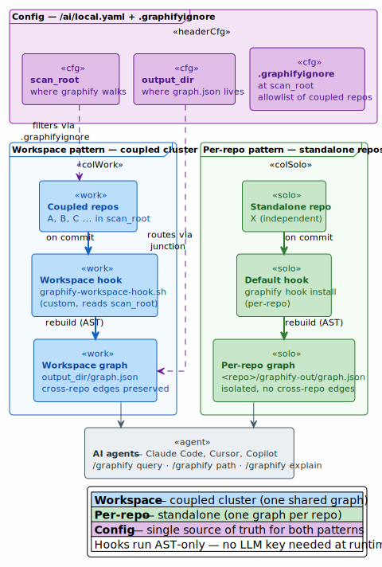
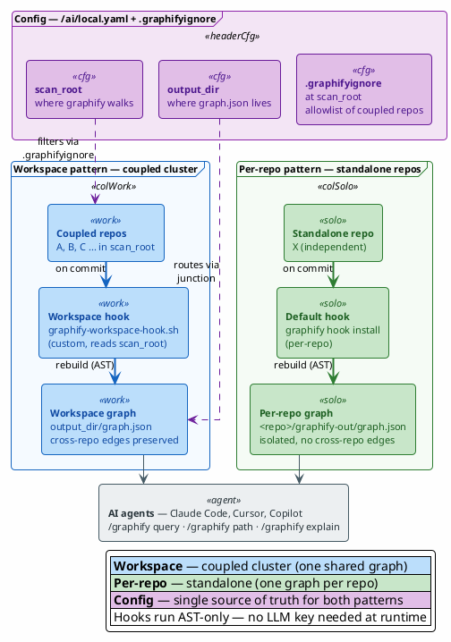
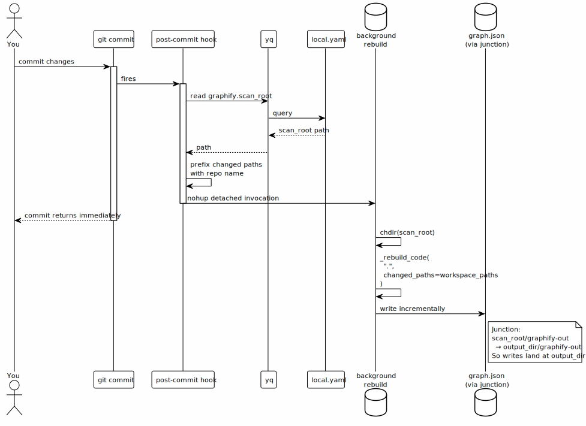
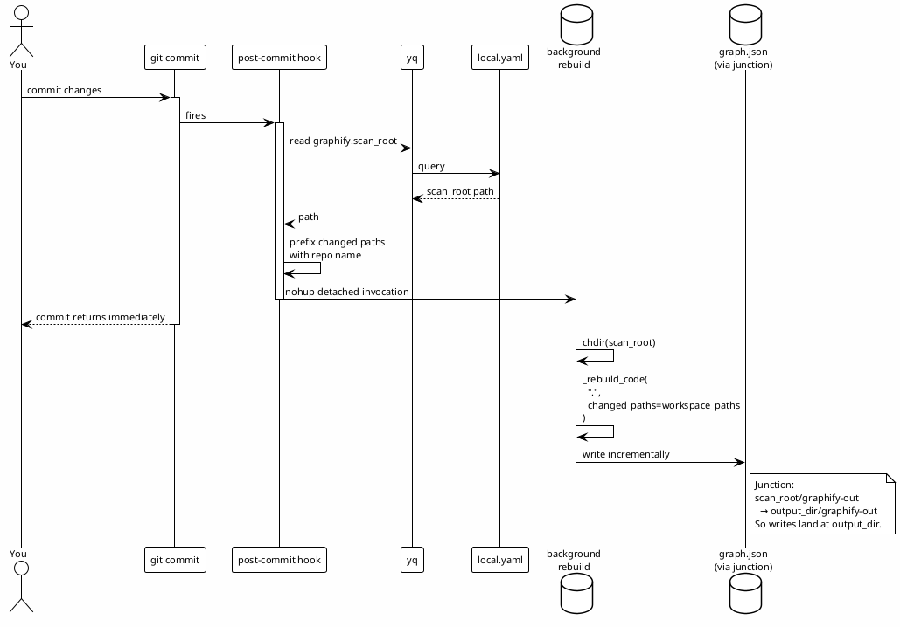

# Graphify Workspace + Per-Repo Setup

> Implementation guide for a **dual-mode graphify deployment** — one workspace graph spanning a coupled cluster of repos, plus per-repo graphs for everything else.
>
> Companion to [code-intelligence-for-ai-agents.md](./code-intelligence-for-ai-agents.md) (which surveys the problem space and design alternatives). This doc is the **how**, that one is the **why**.
>
> Last updated: 2026-06-02

---

## TL;DR

```
┌─────────────────────────┐         ┌─────────────────────────┐
│  Coupled repo cluster   │ ───────▶│   workspace graph       │
│  (e.g. work product)    │  hooks  │   (cross-repo edges)    │
└─────────────────────────┘         └─────────────────────────┘

┌─────────────────────────┐         ┌─────────────────────────┐
│  Standalone repos       │ ───────▶│   per-repo graphs       │
│  (e.g. personal tools)  │  hooks  │   (isolated, simple)    │
└─────────────────────────┘         └─────────────────────────┘
```

Use the **workspace pattern** when you need cross-repo queries like *"what calls `Foo.Bar` across services?"* Use **per-repo** when the repo is mostly independent and you just want fast in-repo navigation.

---

## When to use which pattern

| Pattern | Best for | Trade-offs |
|---|---|---|
| **Workspace graph** | Multi-repo product where services call each other (HTTP, NuGet refs, shared libs) | One large graph; rebuild on any-repo commit; cross-repo edges preserved |
| **Per-repo graph** | Independent tools / utilities / personal projects | Smaller graphs; fast rebuilds; no cross-repo navigation |

You can run **both** on one machine. The two modes don't interfere — they live in different `graphify-out/` directories.

---

## Architecture





---

## Setup — generic steps

### Step 0 — Prerequisites

```bash
# Install graphify (CLI + Python package)
uv tool install graphifyy
# OR: pipx install graphifyy

# Register as a Claude Code skill (creates ~/.claude/skills/graphify/)
graphify install
```

You do **not** need an LLM API key for AST-only operation, but the bare `graphify <path>` CLI invocation will demand one. The hooks and the build script below bypass this by calling graphify's internals directly.

### Step 1 — Decide your scope split

Two questions:

1. **Which repos talk to each other?** Group those — they become your *coupled cluster*. Example: a microservice product where services share NuGet packages or call each other over HTTP.
2. **Which repos are standalone?** Each gets its own per-repo graph.

Worktrees are usually NOT separately useful — they share `.git` with their parent and contain near-identical code on different branches. Skip them.

### Step 2 — Set up the coupled cluster (workspace pattern)

#### a. Pick a parent directory for the coupled repos

Doesn't have to contain ONLY those repos. The `.graphifyignore` allowlist filters in just the ones you want.

Example: all your repos already live under `~/code/`. That's your `scan_root`.

#### b. Create `.graphifyignore` at `scan_root`

```gitignore
# Deny everything by default
*

# Re-include the coupled cluster (one entry per repo, must end in /)
!service-a/
!service-b/
!shared-libs/
!gateway/

# Skip noise inside the allowed dirs
**/.git/
**/node_modules/
**/bin/
**/obj/
**/dist/
**/build/
```

The deny-then-allowlist pattern keeps the ignore file stable as you add new repos to the parent dir — new ones are excluded by default; only explicit additions to the allowlist join the workspace.

#### c. Pick a separate `output_dir` (recommended)

Keep graph artifacts OUT of your source-code tree. Example: `~/workspace/graphs/myproduct/graphify-out/`. The hook script will route writes there via a junction.

#### d. Configure `~/ai/local.yaml`

```yaml
graphify:
  scan_root:  /path/to/coupled/repos          # parent dir containing the cluster
  output_dir: /path/to/workspace/graphify-out  # where graph.json lives
```

#### e. Create the junction (Windows) or symlink (macOS/Linux)

The hook script writes graph output to `scan_root/graphify-out/`. To redirect those writes to `output_dir`, create a directory link:

**Windows (no admin needed, uses junction):**
```bash
# Via PowerShell from Git Bash
powershell.exe -NoProfile -Command "cmd /c mklink /J <scan_root>\graphify-out <output_dir>"
```

**macOS/Linux:**
```bash
ln -s <output_dir> <scan_root>/graphify-out
```

Verify:
```bash
ls -la <scan_root>/graphify-out      # should show -> <output_dir>
```

#### f. Install the workspace hook in each coupled repo

Copy the hook script (`graphify-workspace-hook.sh` — see below) into `<repo>/.git/hooks/post-commit` and `<repo>/.git/hooks/post-checkout` for each repo in the cluster. For Husky-using repos, install at `<repo>/.husky/post-commit` and `.../post-checkout` instead.

#### g. Initial build

The hook only rebuilds INCREMENTALLY (changed files only). The first build needs to be a full build. Use the AST-only builder script (also below):

```bash
cd <scan_root>
python ~/.local/bin/graphify-ast-build.py
```

Result: full `graph.json` + `GRAPH_REPORT.md` at `<output_dir>/`.

### Step 3 — Set up each standalone repo (per-repo pattern)

For each standalone repo, just install graphify's default hooks:

```bash
cd <repo>
graphify hook install
```

That installs post-commit + post-checkout hooks targeting `<repo>/graphify-out/`. Each commit rebuilds the per-repo graph in place.

Initial build (without LLM key):
```bash
cd <repo>
python ~/.local/bin/graphify-ast-build.py
```

Add `graphify-out/` to the repo's `.gitignore` so graph artifacts don't get tracked.

---

## The scripts

Both scripts go in `~/.local/bin/` (or wherever your `$PATH` points):

### Hook scripts (workspace pattern)

Four event hooks share one library, all in `~/.local/bin/` and installed as **copies** into each coupled repo's `.git/hooks/`:

- `graphify-workspace-hook.sh` — post-commit + post-checkout
- `graphify-post-merge-hook.sh` — post-merge (catches `git pull`; diffs `ORIG_HEAD..HEAD`, not `HEAD~1..HEAD`, so multi-commit pulls aren't truncated to the last commit)
- `graphify-post-rewrite-hook.sh` — post-rewrite (rebase / `commit --amend`)
- `graphify-hook-lib.sh` — shared POSIX-sh library sourced by the three event hooks

They call graphify's internal `_rebuild_code` against the **workspace scan_root** (not the calling repo) and prefix changed paths with the canonical repo name so they're workspace-relative.

Key behaviors (in the lib):
- Derives the **canonical** repo name from `git rev-parse --git-common-dir`'s parent (worktree-safe), so changed paths prefix correctly for the workspace graph
- Reads `scan_root` from `~/ai/local.yaml` via `yq` (fallback `/c/Repositories`)
- Skips during rebase/merge/cherry-pick; honors `GRAPHIFY_SKIP_HOOK=1`
- Detects the uv-installed graphifyy Python
- Detached background rebuild under an mkdir lock (serializes the shared-graph write); `git commit` returns immediately
- Logs to `~/.cache/graphify-workspace-rebuild.log`

Source-of-truth is `~/.local/bin/`; re-deploy the copies with `graphify-hooks-rollout.sh`.

### `graphify-ast-build.py` (initial builds, AST-only)

Drives graphify's pipeline manually, skipping the semantic (LLM) step:

1. `graphify.detect.detect(cwd)` — file detection
2. `graphify.extract.extract(code_files)` — AST extraction via Tree-sitter
3. Empty semantic merge
4. `graphify.build.build_from_json` + clustering + report generation
5. Writes `graph.json` + `GRAPH_REPORT.md` to `cwd/graphify-out/`

Use it for any initial build where you don't want to set an LLM API key. The default `graphify <path>` CLI requires a key even for AST-only operations — this script bypasses that.

```bash
cd <any-repo-or-workspace>
python ~/.local/bin/graphify-ast-build.py
```

---

## Data flow on commit





---

## Trade-offs and gotchas

**LLM key.** Graphify's CLI invocation (`graphify <path>`) demands an LLM key even for AST-only operation. The hooks and the build script bypass this by calling internals (`_rebuild_code`, `graphify.extract.extract`) directly. If you skip the workaround scripts and run the CLI, set `GEMINI_API_KEY` (cheapest) or `ANTHROPIC_API_KEY`.

**Windows symlinks vs junctions.** Symbolic links on Windows require admin OR Developer Mode. Junctions don't (since 2008). Junctions only work same-volume, directory only — sufficient for the `scan_root/graphify-out → output_dir` redirect.

**Cross-repo edges in workspace mode.** Graphify's structural extraction across multiple repos under one scan_root produces cross-repo edges where appropriate (shared symbol references, etc.). This is the entire point of the workspace pattern.

**Per-repo hook + workspace hook in same repo = double rebuild.** If a repo is in BOTH a coupled cluster and you accidentally run `graphify hook install`, you'd have two competing hooks. Audit `.git/hooks/post-commit` before installing.

**Worktree inheritance.** Git worktrees inherit `.git/hooks/`, so hooks installed on the canonical repo automatically apply to all its worktrees. Husky-based repos may differ — `.husky/` is in the working tree.

**Polluting the source tree.** The default graphify behavior writes `graphify-out/` inside the directory it scans. For workspace mode at a generic `scan_root`, that means graph artifacts land alongside your source code. The junction trick documented here is the workaround — point a stable name at a separate location.

---

## Cross-references

- **Why this pattern exists** (problem space + alternatives): [code-intelligence-for-ai-agents.md](./code-intelligence-for-ai-agents.md)
- **Graphify upstream**: https://github.com/safishamsi/graphify
- **Companion qdrant RAG setup**: [../mcps/qdrant-mcp/README.md](../mcps/qdrant-mcp/README.md) — complementary semantic-search layer
