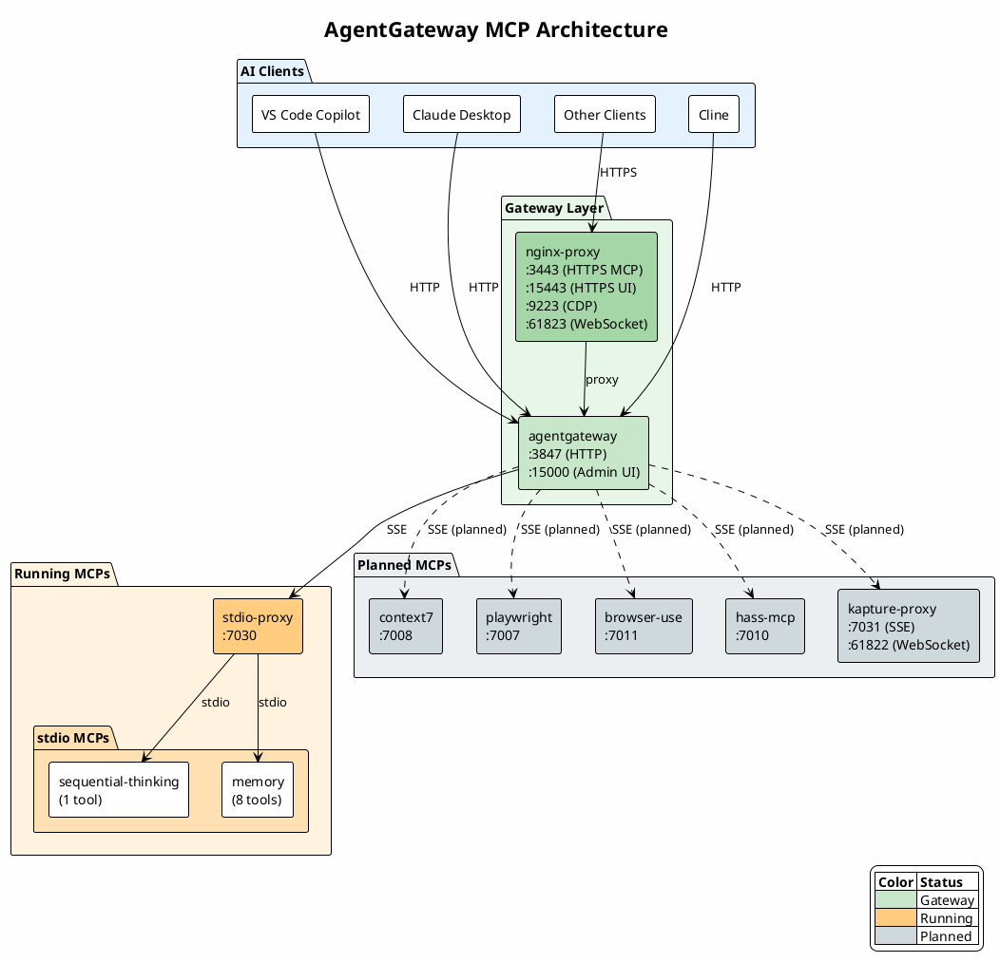

# agentgateway

agentgateway is an open-source MCP gateway/proxy from the Linux Foundation. It serves as a central entrypoint for multiple MCP servers, routing requests to appropriate backends.

See <https://agentgateway.dev/docs/> and <https://github.com/agentgateway/agentgateway>

## Current Status

✅ **Working** - agentgateway is running and serving 9 tools from 2 MCP backends.

## Ports

| Port  | Protocol | Description              |
| ----- | -------- | ------------------------ |
| 3847  | HTTP     | MCP endpoint             |
| 15001 | HTTP     | Admin UI Dashboard       |
| 3443  | HTTPS    | MCP endpoint (via nginx) |

## Configured MCP Backends

### Currently Running

| MCP Server          | Port | Transport | Container/Source            | Tools |
| ------------------- | ---- | --------- | --------------------------- | ----- |
| sequential-thinking | 7030 | SSE       | stdio-proxy (via mcp-proxy) | 1     |
| memory              | 7030 | SSE       | stdio-proxy (via mcp-proxy) | 8     |

### Planned (not yet running)

| MCP Server | Port | Transport | Container/Source            | Status  |
| ---------- | ---- | --------- | --------------------------- | ------- |
| context7   | 7008 | SSE       | context7 container          | Pending |
| playwright | 7007 | SSE       | playwright container        | Pending |
| browser-use| 7011 | SSE       | browser-use container       | Pending |
| hass-mcp   | 7010 | SSE       | hass-mcp container          | Pending |
| kapture    | 7031 | SSE       | kapture-proxy (WebSocket)   | Pending |

### Architecture



### Container Components

This setup uses Docker Compose with three containers on the `mcpx_ai-infrastructure` network:

#### 1. agentgateway (MCP Gateway)

The core MCP gateway from the Linux Foundation.

| Setting        | Value                                     |
| -------------- | ----------------------------------------- |
| Image          | `ghcr.io/agentgateway/agentgateway:latest`|
| Container Name | `agentgateway`                            |
| MCP Port       | 3847 (HTTP)                               |
| Admin UI Port  | 15000 (internal) → 15001 (external)       |
| Config         | `/config/config.yaml`                     |

**Features:**

- Routes MCP requests to multiple backend targets
- Aggregates tools from all configured MCPs
- Supports SSE transport for backend connections
- Admin UI at `http://localhost:15001/ui`

#### 2. nginx-proxy (SSL/WebSocket Proxy)

NGINX reverse proxy for SSL termination and WebSocket support.

| Setting        | Value                      |
| -------------- | -------------------------- |
| Image          | `nginx:alpine`             |
| Container Name | `agentgateway-proxy`       |
| HTTPS MCP      | 3443                       |
| HTTPS UI       | 15443                      |
| CDP Proxy      | 9223 (Chrome DevTools)     |
| WebSocket      | 61823 (for Kapture)        |

**Features:**

- SSL/TLS termination with custom certificates
- Proxies to agentgateway backend
- SSE-compatible (buffering disabled)
- WebSocket-ready for Kapture integration

#### 3. stdio-proxy (stdio→SSE Bridge)

Bridges stdio-based MCPs to SSE transport (runs separately in `/mcps/stdio-proxy/`).

| Setting        | Value                                    |
| -------------- | ---------------------------------------- |
| Image          | Custom (based on mcp-proxy)              |
| Container Name | `stdio-proxy`                            |
| SSE Port       | 7030                                     |
| MCPs           | sequential-thinking, memory              |

**Features:**

- Uses [mcp-proxy](https://github.com/sparfenyuk/mcp-proxy) to expose stdio MCPs as SSE
- Runs `npx` commands for Node.js-based MCPs
- Each MCP exposed at `/servers/<name>/sse`

### stdio-proxy Endpoints

Some MCP servers only support stdio transport (sequential-thinking, memory). These run inside the `stdio-proxy` container which uses [mcp-proxy](https://github.com/sparfenyuk/mcp-proxy) to expose them as SSE endpoints.

Location: `/mcps/stdio-proxy/`

- **sequential-thinking**: `http://localhost:7030/servers/sequential-thinking/sse`
- **memory**: `http://localhost:7030/servers/memory/sse`

## Client Configuration

### VS Code Copilot

Uses `mcp-remote` to bridge stdio→HTTP. Configuration in VS Code MCP settings:

```json
{
  "servers": {
    "agentgateway": {
      "command": "npx",
      "args": ["mcp-remote@latest", "http://localhost:3847/mcp"]
    }
  }
}
```

### Cline / Claude Desktop

Direct HTTP connection:

```json
{
  "mcpServers": {
    "agentgateway": {
      "url": "http://localhost:3847/mcp"
    }
  }
}
```

## Setup

### Prerequisites

1. Create the shared Docker network (if it doesn't exist):

   ```bash
   docker network create mcpx_ai-infrastructure
   ```

2. Start the stdio-proxy container first (required for sequential-thinking and memory):

   ```bash
   cd ../mcps/stdio-proxy
   docker-compose up -d
   ```

3. (Optional) Copy SSL certificates for HTTPS:

   ```bash
   mkdir -p certs
   openssl req -x509 -nodes -days 365 -newkey rsa:2048 \
     -keyout certs/key.pem -out certs/cert.pem \
     -subj "/CN=localhost"
   ```

### Run

```bash
docker-compose up -d
```

### Access

- **Admin UI Dashboard**: <http://localhost:15001/ui>
- **MCP Endpoint**: <http://localhost:3847/mcp>
- **HTTPS MCP**: <https://localhost:3443/mcp>

## Configuration

Edit `config.yaml` to add/remove MCP targets. Changes require a container restart:

```bash
docker-compose restart agentgateway
```

### Adding a New SSE-based MCP

Add to `config.yaml` under `backends.mcp.targets`:

```yaml
- name: new-mcp
  sse:
    host: http://host.docker.internal:PORT/sse
```

### Adding a New stdio-based MCP

1. Add to `../mcps/stdio-proxy/servers.json`
2. Rebuild stdio-proxy: `docker-compose up -d --build`
3. Add to agentgateway config pointing to stdio-proxy

### DNS Notes

agentgateway uses `host.docker.internal` to reach other containers. This is required because:

- agentgateway runs in Docker but needs to reach ports exposed on the host
- Container-to-container DNS resolution didn't work reliably with agentgateway's Go resolver

## Upcoming: Kapture Integration

Kapture is a Chrome extension MCP that requires WebSocket transport. We'll add it via a dedicated proxy:

```text
Chrome Extension ←──WebSocket──→ kapture-proxy ←──SSE──→ agentgateway
                     :61822           :7031             :3847
```

**Requirements:**

- WebSocket server on port 61822 for Chrome extension
- SSE endpoint on port 7031 for agentgateway
- Container: `ghcr.io/nicholaslee119/kapture-mcp:latest`

**Status:** ⏳ Pending (will be added in a separate commit)

## Comparison to MCPX

| Feature            | MCPX (Lunar)     | agentgateway      |
| ------------------ | ---------------- | ----------------- |
| MCP Gateway        | ✅               | ✅                |
| Authentication     | ❌               | ✅ (JWT, OAuth2)  |
| Authorization/RBAC | ❌               | ✅ (CEL policies) |
| Native TLS         | ❌               | ✅                |
| Rate Limiting      | ❌               | ✅                |
| OpenAPI → MCP      | ❌               | ✅                |
| A2A Protocol       | ❌               | ✅                |
| Hot Reload         | Restart required | ✅ (via xDS)      |

## Troubleshooting

### DNS Resolution Failed

If you see "backends required DNS resolution which failed":

1. Ensure docker-compose.yml has `dns: - 127.0.0.11`
2. Use `host.docker.internal:PORT` for backend URLs instead of container names

### prompts/list 500 Error

This is expected - some MCP backends don't implement prompts. It doesn't affect tool discovery.

### Slow Initial Response

First `tools/list` request takes ~4 seconds as agentgateway queries all backends. Subsequent requests are faster.

## TODO

- [ ] Configure authentication (JWT/OAuth2)
- [ ] Set up RBAC policies
- [ ] Add kapture MCP via WebSocket proxy
- [ ] Configure rate limiting for production
- [ ] Set up xDS for hot-reload without restarts
