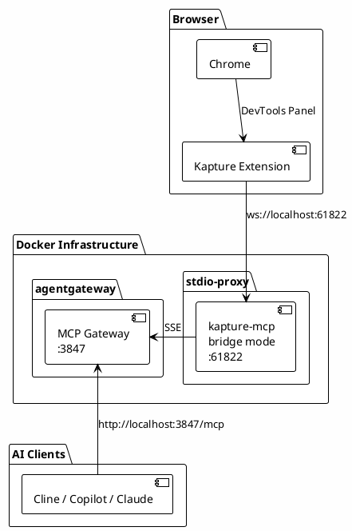

# Kapture MCP

Kapture is a Chrome DevTools Extension that enables browser automation through the Model Context Protocol (MCP).

- 🔗 **Extension**: [Chrome Web Store](https://chromewebstore.google.com/detail/kapture/aeojbjkdienbkmfdhdllobehhcklhecp)
- 📖 **Docs**: [Kapture GitHub](https://github.com/anthropics/kapture)

## Architecture



**Data Flow:**

1. Kapture Chrome extension connects via WebSocket directly to `localhost:61822` (stdio-proxy)
2. kapture-mcp exposes tools via SSE to agentgateway
3. AI clients connect to agentgateway and use Kapture tools

> **Note:** The Chrome extension port (61822) is hardcoded and not configurable. stdio-proxy exposes this port directly - no nginx proxy needed.

## Status

✅ **Configured** - Integrated with agentgateway via stdio-proxy.

| Component    | Port  | Purpose                                                   |
| ------------ | ----- | --------------------------------------------------------- |
| stdio-proxy  | 61822 | Kapture WebSocket bridge (Chrome extension connects here) |
| agentgateway | 3847  | MCP tools endpoint                                        |

## How It Works

### Chrome Extension

- Install Kapture extension from Chrome Web Store
- Open Chrome DevTools (F12 or Cmd+Option+I)
- Navigate to "Kapture" panel
- Extension automatically connects to `localhost:61823`

### WebSocket Proxy (nginx)

### Kapture MCP Server

Runs in stdio-proxy container via `npx kapture-mcp bridge`:

```json
{
  "kapture": {
    "command": "npx",
    "args": ["-y", "kapture-mcp", "bridge"],
    "env": {
      "KAPTURE_BRIDGE_PORT": "61822"
    }
  }
}
```

## Available Tools

| Tool           | Description                     |
| -------------- | ------------------------------- |
| `list_tabs`    | List all connected browser tabs |
| `navigate`     | Navigate to URL                 |
| `click`        | Click elements                  |
| `fill`         | Fill input fields               |
| `screenshot`   | Capture screenshots             |
| `elements`     | Query DOM elements              |
| `console_logs` | Get console output              |

## Installation

1. Install Kapture Chrome extension from [Chrome Web Store](https://chromewebstore.google.com/detail/kapture/aeojbjkdienbkmfdhdllobehhcklhecp)

2. Open Chrome DevTools → "Kapture" panel

3. Ensure infrastructure is running (see [root README](../../README.md))

## Troubleshooting

| Issue                   | Solution                                    |
| ----------------------- | ------------------------------------------- |
| Extension won't connect | Verify nginx listening: `lsof -i :61822`    |
| WebSocket errors        | Check nginx logs: `docker logs nginx-proxy` |
| No tools appearing      | Verify kapture-mcp in stdio-proxy logs      |

## Related

- [agentgateway](../../gateways/agentgateway/readme.md) - MCP gateway
- [stdio-proxy](../stdio-proxy/readme.md) - stdio→SSE bridge
