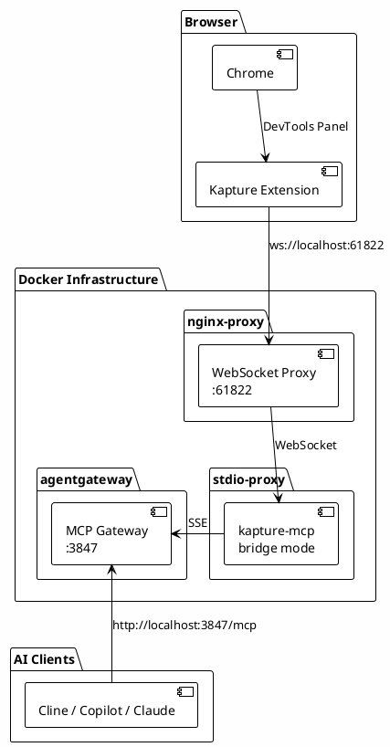

# Kapture MCP

Kapture is a Chrome DevTools Extension that enables browser automation through the Model Context Protocol (MCP).

- 🔗 **Extension**: [Chrome Web Store](https://chromewebstore.google.com/detail/kapture/aeojbjkdienbkmfdhdllobehhcklhecp)
- 📖 **Docs**: [Kapture GitHub](https://github.com/anthropics/kapture)

## Architecture



**Data Flow:**

1. Kapture Chrome extension connects via WebSocket to `localhost:61822`
2. nginx-proxy forwards WebSocket to kapture-mcp running in stdio-proxy
3. kapture-mcp exposes tools via SSE to agentgateway
4. AI clients connect to agentgateway and use Kapture tools

## Status

⏳ **Planned** - Not yet integrated with agentgateway.

### TODO

- [ ] Add kapture-mcp to stdio-proxy configuration
- [ ] Configure nginx-proxy WebSocket forwarding on port 61822
- [ ] Add Kapture backend to agentgateway config.yaml
- [ ] Test end-to-end with Chrome extension

## How It Works

### Chrome Extension

- Install Kapture extension from Chrome Web Store
- Open Chrome DevTools (F12 or Cmd+Option+I)
- Navigate to "Kapture" panel
- Extension automatically connects to `localhost:61822`

### WebSocket Proxy (nginx)

The nginx-proxy in agentgateway handles WebSocket connections:

```nginx
server {
    listen 61822;
    location / {
        proxy_pass http://stdio-proxy:61822;
        proxy_http_version 1.1;
        proxy_set_header Upgrade $http_upgrade;
        proxy_set_header Connection "upgrade";
        proxy_read_timeout 3600s;
    }
}
```

### Kapture MCP Server

Runs in stdio-proxy container via `npx kapture-mcp bridge`:

```json
{
  "kapture": {
    "command": "npx",
    "args": ["-y", "kapture-mcp", "bridge"]
  }
}
```

## Available Tools

| Tool | Description |
| ---- | ----------- |
| `list_tabs` | List all connected browser tabs |
| `navigate` | Navigate to URL |
| `click` | Click elements |
| `fill` | Fill input fields |
| `screenshot` | Capture screenshots |
| `elements` | Query DOM elements |
| `console_logs` | Get console output |

## Installation

1. Install Kapture Chrome extension from [Chrome Web Store](https://chromewebstore.google.com/detail/kapture/aeojbjkdienbkmfdhdllobehhcklhecp)

2. Open Chrome DevTools → "Kapture" panel

3. Ensure infrastructure is running (see [root README](../../README.md))

## Troubleshooting

| Issue | Solution |
| ----- | -------- |
| Extension won't connect | Verify nginx listening: `lsof -i :61822` |
| WebSocket errors | Check nginx logs: `docker logs nginx-proxy` |
| No tools appearing | Verify kapture-mcp in stdio-proxy logs |

## Related

- [agentgateway](../../gateways/agentgateway/readme.md) - MCP gateway
- [stdio-proxy](../stdio-proxy/readme.md) - stdio→SSE bridge
