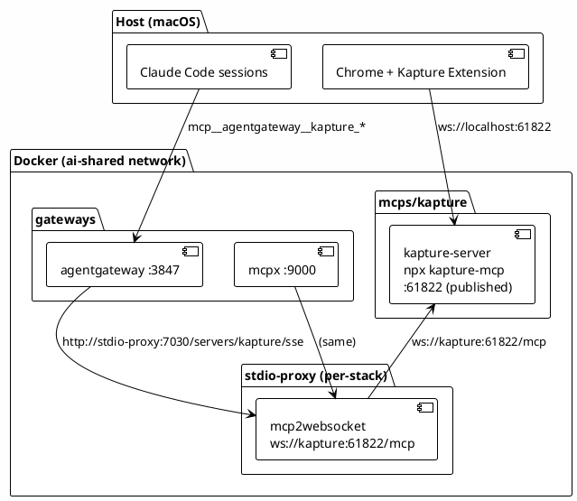

# Kapture MCP

Kapture is a Chrome DevTools Extension that enables browser automation through the
Model Context Protocol (MCP).

- 🔗 **Extension**: [Chrome Web Store](https://chromewebstore.google.com/detail/kapture/aeojbjkdienbkmfdhdllobehhcklhecp)
- 📖 **Docs**: [williamkapke/kapture](https://github.com/williamkapke/kapture)
- 📦 **Package**: [`kapture-mcp` on npm](https://www.npmjs.com/package/kapture-mcp)

## Architecture

A single containerized Kapture WebSocket server (`kapture-server`) is shared by
the host's Chrome extension and every gateway that needs Kapture tools. There
is no per-session bridge or native host server.


```plantuml
@startuml Kapture Architecture
!theme plain
skinparam backgroundColor #FEFEFE

package "Host (macOS)" {
  [Chrome + Kapture Extension] as ext
  [Claude Code sessions] as claude
}

package "Docker (ai-shared network)" {
  package "mcps/kapture" {
    [kapture-server\nnpx kapture-mcp\n:61822 (published)] as kserver
  }

  package "stdio-proxy (per-stack)" {
    [mcp2websocket\nws://kapture:61822/mcp] as bridge
  }

  package "gateways" {
    [agentgateway :3847] as agw
    [mcpx :9000] as mcpx
  }
}

ext -down-> kserver : ws://localhost:61822
bridge -up-> kserver : ws://kapture:61822/mcp
agw -down-> bridge : http://stdio-proxy:7030/servers/kapture/sse
mcpx -down-> bridge : (same)
claude -right-> agw : mcp__agentgateway__kapture_*

@enduml
```

**Data flow:**

1. The Chrome extension connects to `ws://localhost:61822` — Docker publishes the
   `kapture-server` container's port 61822 to the host.
2. Inside `mcp__agentgateway__kapture_*` (or `mcp__mcpx__kapture_*`) tool calls,
   the gateway proxies to its stdio-proxy at `http://stdio-proxy:7030/servers/kapture/sse`.
3. stdio-proxy spawns `npx mcp2websocket ws://kapture:61822/mcp` — a thin
   stdio↔WebSocket bridge that connects to `kapture-server` over the
   `ai-shared` Docker network.
4. The MCP request flows: Claude Code → gateway → stdio-proxy → mcp2websocket → kapture-server → Chrome extension.

## Why this shape

The `kapture-mcp` npm package's `bridge` mode hard-codes `ws://localhost:61822/mcp`
and unconditionally `spawn`s a server when started. That's fine on a host
where the WS server actually lives, but inside a container it spawns a redundant
in-container server with no Chrome extension attached — pure cruft.

We bypass `kapture-mcp` inside containers and use [`mcp2websocket`](https://www.npmjs.com/package/mcp2websocket)
directly, pointing it at the shared `kapture-server` service by hostname. The
package is the underlying bridge library that `kapture-mcp bridge` wraps, so
this is functionally identical without the local-server side effect.

## Components

| Component                  | Where                                                       | Purpose                                                  |
| -------------------------- | ----------------------------------------------------------- | -------------------------------------------------------- |
| `kapture-server` container | `mcps/kapture/docker-compose.yml`                           | Single WS server on port 61822 (host-published)          |
| `kapture` MCP entry        | `mcps/stdio-proxy/servers.home.json`                        | Spawns `mcp2websocket` pointing at `ws://kapture:61822/mcp` |
| stdio-proxy network        | parent compose (`mcpx`, `agentgateway`) joins `ai-shared`   | Lets each stack's stdio-proxy resolve `kapture` hostname |
| Chrome extension           | host browser                                                | Connects to `localhost:61822` (the published port)       |

## Networks

- `kapture-server` is on `ai-shared` with aliases `kapture` and `kapture-server`.
- `mcpx-stdio-proxy-1` and `agentgateway-stdio-proxy-1` join both their private
  per-stack `default` network (so they keep resolving `stdio-proxy` locally —
  see commit `6e7fc82`) and `ai-shared` (so they can reach `kapture`).
- The standalone `stdio-proxy` stack stays out of `ai-shared`.

## Available tools

| Tool                | Description                       |
| ------------------- | --------------------------------- |
| `navigate`          | Navigate to URL                   |
| `back` / `forward`  | Browser history                   |
| `click` / `hover`   | Mouse interactions                |
| `fill`              | Fill input fields                 |
| `select`            | Select dropdown options           |
| `evaluate`          | Execute JavaScript                |
| `elements`          | Query DOM by CSS selector / XPath |

Resources: `kapture://tabs`, `kapture://tab/{id}`, `kapture://tab/{id}/console`,
`kapture://tab/{id}/screenshot`, `kapture://tab/{id}/dom`,
`kapture://tab/{id}/elementsFromPoint`,
`kapture://tab/{id}/elements?selector=...`.

## Operations

```bash
# Bring up the kapture server
docker compose -f mcps/kapture/docker-compose.yml up -d

# Verify it's up and reachable from the host
curl -s http://localhost:61822/ | jq .

# Verify a stdio-proxy can resolve and reach it
docker exec mcpx-stdio-proxy-1 getent hosts kapture
docker exec mcpx-stdio-proxy-1 wget -qO- http://kapture:61822/

# Status of all MCP servers in a stdio-proxy
docker exec mcpx-stdio-proxy-1 wget -qO- http://127.0.0.1:7030/status
```

## Troubleshooting

| Symptom                                            | Cause / fix                                                                                                  |
| -------------------------------------------------- | ------------------------------------------------------------------------------------------------------------ |
| Chrome extension can't connect to `localhost:61822` | `kapture-server` container down, or a native `npx kapture-mcp` is hogging the port. Run `lsof -i :61822`. |
| Tool calls hang / "kapture not configured"         | stdio-proxy can't reach `kapture` over `ai-shared`. Check `docker exec ... getent hosts kapture`.            |
| In-container `Kapture MCP Server` reappears        | Someone reverted `servers.home.json` to `kapture-mcp bridge`. It must use `mcp2websocket` directly.          |
| Per-session bridges show up in `ps`                | `~/.claude.json` (or another MCP client config) re-added a `kapture` stdio entry. Remove it; use the gateway. |

## Related

- [agentgateway](../../gateways/agentgateway/readme.md) — primary MCP gateway
- [mcpx](../mcpx/readme.md) — secondary MCP gateway
- [stdio-proxy](../stdio-proxy/readme.md) — stdio→SSE bridge that hosts the kapture entry
