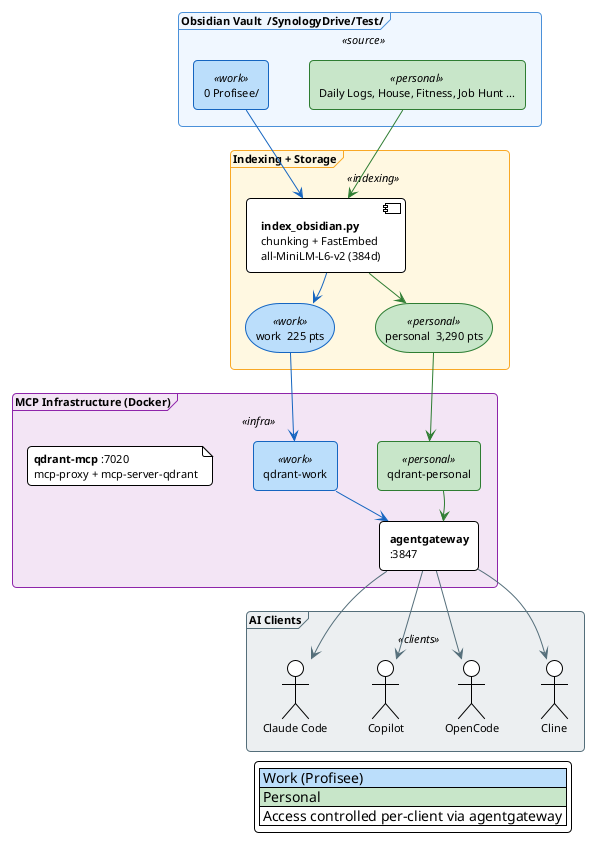

# Qdrant RAG MCP Server

Semantic search over Obsidian vault content via Qdrant vector database, exposed as MCP tools through agentgateway.

## Architecture



## Components

### Qdrant DB

Vector database running in Docker.

```bash
docker run -d --name qdrant \
  -p 6333:6333 -p 6334:6334 \
  -v ~/qdrant_storage:/qdrant/storage \
  qdrant/qdrant
```

### qdrant-mcp Container

Standalone Debian-based container (`python:3.12-slim`) running `mcp-proxy` + `mcp-server-qdrant`. Debian is required because `onnxruntime` (dependency of `fastembed`) has no wheels for Alpine Linux on ARM.

- **Port:** 7020
- **Embedding model:** `sentence-transformers/all-MiniLM-L6-v2` (384 dimensions)
- **Vector name:** `fast-all-minilm-l6-v2` (set by mcp-server-qdrant's FastEmbed provider)
- **Named servers:** `qdrant-work` and `qdrant-personal` (configured in `servers.json`)

```bash
# Build and start
docker compose up -d --build

# Rebuild after config changes
docker compose up -d --build && docker compose restart
```

### Indexer

Python script that walks the Obsidian vault, chunks markdown files, generates embeddings, and upserts to Qdrant.

Location: `indexer/index_obsidian.py`

#### Routing Logic

| Vault Path | Collection |
|---|---|
| `0 Profisee/**` | `work` |
| Everything else | `personal` |

#### Skipped Directories

`.obsidian`, `.trash`, `.history`, `attachments`, `copilot-conversations`, `copilot-custom-prompts`, `Templates`

#### Usage

```bash
cd indexer
source .venv/bin/activate

# Incremental index (skips unchanged files)
python index_obsidian.py

# Full re-index
python index_obsidian.py --force

# Preview without writing
python index_obsidian.py --dry-run
```

#### How It Works

1. Walks `~/SynologyDrive/Test/` for `.md` files
2. Skips excluded directories and unchanged files (tracked via `.index_state.json`)
3. Chunks by markdown headers (H1-H3), falls back to paragraph splitting, max ~800 chars
4. Prepends document title to each chunk for better embedding context
5. Uses `passage_embed` (not `embed` or `query_embed`) to match MCP server behavior
6. Upserts with named vector `fast-all-minilm-l6-v2` and metadata payload
7. Cleans up points for deleted files

#### First-Time Setup

```bash
cd indexer
python3 -m venv .venv
source .venv/bin/activate
pip install -r requirements.txt
python index_obsidian.py
```

## Gateway Configuration

### agentgateway (`config.yaml`)

```yaml
- name: qdrant-work
  sse:
    host: http://host.docker.internal:7020/servers/qdrant-work/sse
- name: qdrant-personal
  sse:
    host: http://host.docker.internal:7020/servers/qdrant-personal/sse
```

### mcpx (`mcp.json`)

Two server entries pointing at each named server SSE endpoint on port 7020.

### mcpx (`app.yaml`)

```yaml
toolGroups:
  - name: knowledge-work
    services:
      qdrant-work: "*"
  - name: knowledge-personal
    services:
      qdrant-personal: "*"
```

Consumers opt into `knowledge-work` and/or `knowledge-personal` in their `allow` list.

### Permissions

- `permissions.yaml`: `qdrant_*` added to agentgateway auto_approve
- `~/.claude/settings.json`: `mcp__agentgateway__qdrant-work_*` and `mcp__agentgateway__qdrant-personal_*` in allow list

## MCP Tools

Available through agentgateway once configured:

| Tool | Description |
|---|---|
| `qdrant-work_qdrant-find` | Semantic search over work (Profisee) content |
| `qdrant-work_qdrant-store` | Store new entries in work collection |
| `qdrant-personal_qdrant-find` | Semantic search over personal content |
| `qdrant-personal_qdrant-store` | Store new entries in personal collection |

## Current State

- **Work collection:** 225 points (Profisee Captain's Log, notes, session summaries)
- **Personal collection:** 3,389 points (daily logs, renovation, finance, fitness, job hunt, etc.)
- **Embedding model:** `all-MiniLM-L6-v2` (384d, ~45MB)

## Future Work

- [ ] Automate re-indexing via launchd/cron schedule
- [ ] Add code repository indexing (separate `code` collection)
- [ ] Add AI skills + memory indexing
- [ ] Migrate Qdrant DB to Synology NAS
- [ ] Evaluate upgrading to a larger embedding model (nomic-embed-text 768d or mxbai-embed-large 1024d)
