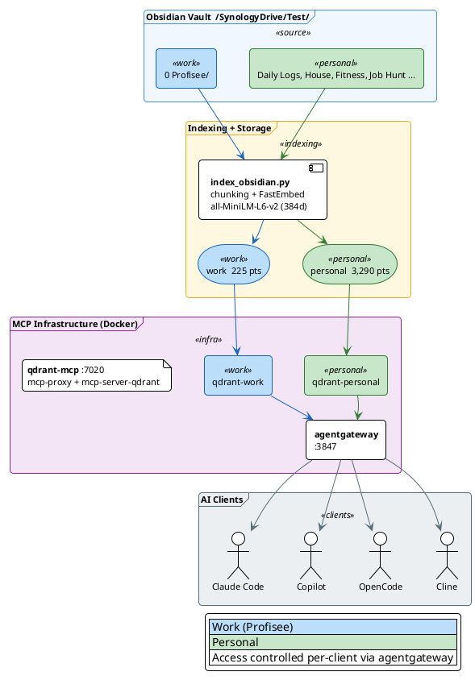

# Qdrant RAG MCP Server

Semantic search over Obsidian vault content via Qdrant vector database, exposed as MCP tools through agentgateway.

## Architecture


```plantuml
@startuml
!theme plain
skinparam backgroundColor white
skinparam roundCorner 8
skinparam defaultFontSize 11
skinparam defaultFontName "Segoe UI"
skinparam shadowing false
skinparam packageStyle frame
skinparam nodesep 40
skinparam ranksep 30

' Top-down flow (layered architecture)

' -- Color palette --
skinparam package {
  BackgroundColor<<source>> #F0F7FF
  BorderColor<<source>> #4A90D9
  BackgroundColor<<indexing>> #FFF8E1
  BorderColor<<indexing>> #F9A825
  BackgroundColor<<infra>> #F3E5F5
  BorderColor<<infra>> #8E24AA
  BackgroundColor<<clients>> #ECEFF1
  BorderColor<<clients>> #546E7A
}

skinparam rectangle {
  BackgroundColor<<work>> #BBDEFB
  BorderColor<<work>> #1565C0
  BackgroundColor<<personal>> #C8E6C9
  BorderColor<<personal>> #2E7D32
}

skinparam storage {
  BackgroundColor<<work>> #BBDEFB
  BorderColor<<work>> #1565C0
  BackgroundColor<<personal>> #C8E6C9
  BorderColor<<personal>> #2E7D32
}

' ══════════════════════════════════════
' LAYER 1: DATA SOURCE
' ══════════════════════════════════════
package "Obsidian Vault  ~/SynologyDrive/Test/" <<source>> {
  rectangle "0 Profisee/" <<work>> as profisee
  rectangle "Daily Logs, House, Fitness, Job Hunt ..." <<personal>> as personal_files
  profisee -[hidden]right- personal_files
}

' ══════════════════════════════════════
' LAYER 2: INDEXING + STORAGE
' ══════════════════════════════════════
package "Indexing + Storage" <<indexing>> {
  component "**index_obsidian.py**\nchunking + FastEmbed\nall-MiniLM-L6-v2 (384d)" as indexer
  storage "work  225 pts" <<work>> as work_col
  storage "personal  3,290 pts" <<personal>> as personal_col
  indexer -[hidden]right- work_col
  work_col -[hidden]right- personal_col
}

' ══════════════════════════════════════
' LAYER 3: MCP INFRASTRUCTURE
' ══════════════════════════════════════
package "MCP Infrastructure (Docker)" <<infra>> {
  rectangle "qdrant-work" <<work>> as work_sse
  rectangle "qdrant-personal" <<personal>> as personal_sse
  rectangle "**agentgateway**\n:3847" as agw
  work_sse -[hidden]right- personal_sse
  personal_sse -[hidden]right- agw
  note as mcp_note
    **qdrant-mcp** :7020
    mcp-proxy + mcp-server-qdrant
  end note
}

' ══════════════════════════════════════
' LAYER 4: AI CLIENTS
' ══════════════════════════════════════
package "AI Clients" <<clients>> {
  actor "Claude Code" as claude
  actor "Copilot" as copilot
  actor "OpenCode" as opencode
  actor "Cline" as cline
  claude -[hidden]right- copilot
  copilot -[hidden]right- opencode
  opencode -[hidden]right- cline
}

' ══════════════════════════════════════
' CONNECTIONS (top-down between layers)
' ══════════════════════════════════════

' Layer 1 → Layer 2: Indexing flow
profisee -[#1565C0]down-> indexer
personal_files -[#2E7D32]down-> indexer
indexer -[#1565C0]down-> work_col
indexer -[#2E7D32]down-> personal_col

' Layer 2 → Layer 3: Query flow
work_col -[#1565C0]down-> work_sse
personal_col -[#2E7D32]down-> personal_sse
work_sse -[#1565C0]down-> agw
personal_sse -[#2E7D32]down-> agw

' Layer 3 → Layer 4: Client access
agw -[#546E7A]down-> claude
agw -[#546E7A]down-> copilot
agw -[#546E7A]down-> opencode
agw -[#546E7A]down-> cline

legend bottom right
  |<#BBDEFB> Work (Profisee) |
  |<#C8E6C9> Personal |
  | Access controlled per-client via agentgateway |
end legend

@enduml
```

## Components

### Qdrant DB

Vector database running in Docker.

```bash
docker run -d --name qdrant \
  -p 6333:6333 -p 6334:6334 \
  -v ~/qdrant_storage:/qdrant/storage \
  qdrant/qdrant
```

### qdrant-mcp Container

Standalone Debian-based container (`python:3.12-slim`) running `mcp-proxy` + `mcp-server-qdrant`. Debian is required because `onnxruntime` (dependency of `fastembed`) has no wheels for Alpine Linux on ARM.

- **Port:** 7020
- **Embedding model:** `sentence-transformers/all-MiniLM-L6-v2` (384 dimensions)
- **Vector name:** `fast-all-minilm-l6-v2` (set by mcp-server-qdrant's FastEmbed provider)
- **Named servers:** Configured in `servers.json` (e.g., `qdrant-work`, `qdrant-personal`)

#### Setup

```bash
# Copy example config and customize for your machine
cp servers.json.example servers.json
# Edit servers.json - remove qdrant-personal if you only need work collection

# Build and start
docker compose up -d --build

# Rebuild after config changes
docker compose up -d --build && docker compose restart
```

### Indexer

Python script that walks the Obsidian vault, chunks markdown files, generates embeddings, and upserts to Qdrant.

Location: `indexer/index_obsidian.py`

#### Setup

```bash
cd indexer

# Copy example config and customize for your machine
cp indexer.yaml.example indexer.yaml
# Edit indexer.yaml:
#   - Set vault_path to your Obsidian vault location
#   - Adjust collections and routing for your needs
#   - Set skip_unrouted: true for work-only indexing

# Create virtual environment
python3 -m venv .venv
source .venv/bin/activate  # Linux/Mac
# .venv\Scripts\activate   # Windows

pip install -r requirements.txt
```

#### Usage

```bash
cd indexer
source .venv/bin/activate

# Index using config file (recommended)
python index_obsidian.py --config indexer.yaml

# Incremental index (skips unchanged files)
python index_obsidian.py --config indexer.yaml

# Full re-index
python index_obsidian.py --config indexer.yaml --force

# Preview without writing
python index_obsidian.py --config indexer.yaml --dry-run
```

#### Configuration (indexer.yaml)

See `indexer.yaml.example` for all options. Key settings:

| Setting | Description |
|---|---|
| `vault_path` | Path to Obsidian vault (machine-specific) |
| `collections` | List of Qdrant collections to use |
| `routing` | Maps folder patterns to collections |
| `skip_unrouted` | `true` = skip unmatched files, `false` = use default_collection |
| `skip_dirs` | Folders to ignore entirely |

#### How It Works

1. Reads config from `indexer.yaml` (or command-line `--config`)
2. Walks vault for `.md` files, skipping excluded directories
3. Routes files to collections based on `routing` rules
4. Skips unchanged files (tracked via `.index_state.json`)
5. Chunks by markdown headers (H1-H3), falls back to paragraph splitting, max ~800 chars
6. Prepends document title to each chunk for better embedding context
7. Uses `passage_embed` (not `embed` or `query_embed`) to match MCP server behavior
8. Upserts with named vector `fast-all-minilm-l6-v2` and metadata payload
9. Cleans up points for deleted files

#### First-Time Setup

```bash
cd indexer
python3 -m venv .venv
source .venv/bin/activate
pip install -r requirements.txt
cp indexer.yaml.example indexer.yaml
# Edit indexer.yaml with your vault path and preferences
python index_obsidian.py --config indexer.yaml
```

## Gateway Configuration

### agentgateway (`config.yaml`)

```yaml
- name: qdrant-work
  sse:
    host: http://host.docker.internal:7020/servers/qdrant-work/sse
- name: qdrant-personal
  sse:
    host: http://host.docker.internal:7020/servers/qdrant-personal/sse
```

### mcpx (`mcp.json`)

Two server entries pointing at each named server SSE endpoint on port 7020.

### mcpx (`app.yaml`)

```yaml
toolGroups:
  - name: knowledge-work
    services:
      qdrant-work: "*"
  - name: knowledge-personal
    services:
      qdrant-personal: "*"
```

Consumers opt into `knowledge-work` and/or `knowledge-personal` in their `allow` list.

### Permissions

- `permissions.yaml`: `qdrant_*` added to agentgateway auto_approve
- `~/.claude/settings.json`: `mcp__agentgateway__qdrant-work_*` and `mcp__agentgateway__qdrant-personal_*` in allow list

## MCP Tools

Available through agentgateway once configured:

| Tool | Description |
|---|---|
| `qdrant-work_qdrant-find` | Semantic search over work (Profisee) content |
| `qdrant-work_qdrant-store` | Store new entries in work collection |
| `qdrant-personal_qdrant-find` | Semantic search over personal content |
| `qdrant-personal_qdrant-store` | Store new entries in personal collection |

## Current State

- **Work collection:** 225 points (Profisee Captain's Log, notes, session summaries)
- **Personal collection:** 3,389 points (daily logs, renovation, finance, fitness, job hunt, etc.)
- **Code collection:** 7,640 points (10 Git repositories — source code, configs, docs)
- **Embedding model:** `all-MiniLM-L6-v2` (384d, ~45MB)

## Repository Indexing

Indexes local Git repositories into a `code` collection for semantic search over codebases.

### Collection

| Collection | Content | MCP Server |
|---|---|---|
| `code` | Source code, configs, docs from Git repos | `qdrant-code` |

Same pattern as `work`/`personal` — named server in `servers.json`, SSE target in agentgateway, tool group in mcpx.

### Configuration

All repo indexer settings live in `indexer/repos.json` — no code changes needed to add/remove repos or adjust skip patterns.

| Key | Purpose |
|---|---|
| `repos_base` | Base directory for repositories (e.g., `~/Repositories`) |
| `repos` | List of repository directory names to index |
| `skip_dirs` | Directories to skip (e.g., `.git`, `node_modules`, `dist`) |
| `skip_files` | Files to skip (e.g., `package-lock.json`, `yarn.lock`) |
| `skip_extensions` | Binary/generated file extensions to skip |
| `index_extensions` | Text file extensions to index |
| `index_filenames` | Specific filenames to always index (e.g., `Dockerfile`, `CLAUDE.md`) |
| `max_chunk_chars` | Maximum chunk size in characters (default: 1200) |

### Chunking Strategy

Code-aware chunking splits by language-specific boundaries:

| Language | Split Pattern |
|---|---|
| Python | `class`, `def`, `async def` |
| TypeScript/JavaScript | `function`, `class`, `const =`, `interface`, `type` |
| Go | `func`, `type` |
| Rust | `fn`, `struct`, `enum`, `impl`, `trait`, `mod` |
| Ruby | `class`, `module`, `def` |
| Shell | Function definitions |
| C#/Java | Class, interface, enum, method declarations |
| Markdown | H1-H3 header boundaries |
| Other text | Paragraph-based fallback, then line-based |

### Usage

```bash
cd indexer
source .venv/bin/activate

# Incremental index (skips unchanged files)
python index_repos.py

# Full re-index
python index_repos.py --force

# Preview without writing
python index_repos.py --dry-run
```

### How It Works

1. Loads configuration from `repos.json`
2. Walks each repository, respecting skip patterns
3. Skips unchanged files (tracked via `.index_repos_state.json` with MD5 hashes)
4. Detects language from file extension for code-aware chunking
5. Prepends `repo/filepath` context to each chunk for better embeddings
6. Uses `passage_embed` with named vector `fast-all-minilm-l6-v2`
7. Upserts with deterministic point IDs: `UUID5(repo::filepath::chunk_index)`
8. Cleans up points for deleted files

### Metadata

Each point stores:

```json
{
  "document": "<chunk content>",
  "metadata": {
    "repo": "ai-infrastructure",
    "file_path": "mcps/qdrant-mcp/indexer/index_obsidian.py",
    "language": "python",
    "chunk_index": 0,
    "total_chunks": 5,
    "collection": "code",
    "last_modified": "2026-02-27T..."
  }
}
```

### MCP Tools

| Tool | Description |
|---|---|
| `qdrant-code_qdrant-find` | Semantic search over indexed repositories |
| `qdrant-code_qdrant-store` | Store entries in code collection |

## Future Work

- [ ] Automate re-indexing via launchd/cron schedule
- [ ] Add AI skills + memory indexing
- [ ] Migrate Qdrant DB to Synology NAS
- [ ] Evaluate upgrading to a larger embedding model (nomic-embed-text 768d or mxbai-embed-large 1024d)

## Direct Client Access (No Gateway)

On machines without agentgateway, AI clients can connect directly to the qdrant-mcp SSE endpoints.

### Claude Desktop (`claude_desktop_config.json`)

```json
{
  "mcpServers": {
    "qdrant-work": {
      "url": "http://localhost:7020/servers/qdrant-work/sse"
    }
  }
}
```

### OpenCode (`opencode.json`)

```json
{
  "mcpServers": {
    "qdrant-work": {
      "type": "sse",
      "url": "http://localhost:7020/servers/qdrant-work/sse"
    }
  }
}
```

This exposes the `qdrant-find` and `qdrant-store` tools directly (prefixed as `qdrant-work_qdrant-find`, etc.).
