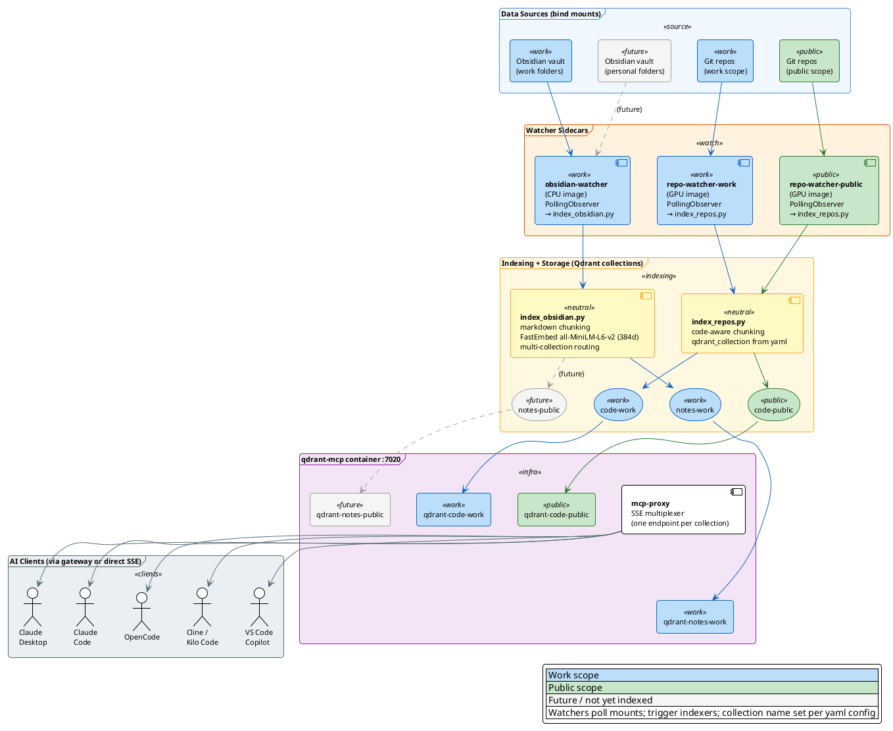

# Qdrant RAG MCP Server

Semantic search over Obsidian vault content and Git repositories via Qdrant vector database, exposed as MCP tools through mcp-proxy SSE endpoints.

## Architecture


```plantuml
@startuml
!theme plain
skinparam backgroundColor white
skinparam roundCorner 8
skinparam defaultFontSize 11
skinparam defaultFontName "Segoe UI"
skinparam shadowing false
skinparam packageStyle frame
skinparam nodesep 40
skinparam ranksep 30

' -- Color palette: scope-based (work / public) + neutral for shared infra --
skinparam package {
  BackgroundColor<<source>> #F0F7FF
  BorderColor<<source>> #4A90D9
  BackgroundColor<<watch>> #FFF3E0
  BorderColor<<watch>> #E65100
  BackgroundColor<<indexing>> #FFF8E1
  BorderColor<<indexing>> #F9A825
  BackgroundColor<<infra>> #F3E5F5
  BorderColor<<infra>> #8E24AA
  BackgroundColor<<clients>> #ECEFF1
  BorderColor<<clients>> #546E7A
}

skinparam rectangle {
  BackgroundColor<<work>> #BBDEFB
  BorderColor<<work>> #1565C0
  BackgroundColor<<public>> #C8E6C9
  BorderColor<<public>> #2E7D32
  BackgroundColor<<future>> #F5F5F5
  BorderColor<<future>> #9E9E9E
}

skinparam storage {
  BackgroundColor<<work>> #BBDEFB
  BorderColor<<work>> #1565C0
  BackgroundColor<<public>> #C8E6C9
  BorderColor<<public>> #2E7D32
  BackgroundColor<<future>> #F5F5F5
  BorderColor<<future>> #9E9E9E
}

skinparam component {
  BackgroundColor<<work>> #BBDEFB
  BorderColor<<work>> #1565C0
  BackgroundColor<<public>> #C8E6C9
  BorderColor<<public>> #2E7D32
  BackgroundColor<<neutral>> #FFF9C4
  BorderColor<<neutral>> #F9A825
}

' ══════════════════════════════════════
' LAYER 1: DATA SOURCES (filesystem mounts)
' ══════════════════════════════════════
package "Data Sources (bind mounts)" <<source>> {
  rectangle "Obsidian vault\n(work folders)" <<work>> as vault_work
  rectangle "Obsidian vault\n(personal folders)" <<future>> as vault_public
  rectangle "Git repos\n(work scope)" <<work>> as repos_work
  rectangle "Git repos\n(public scope)" <<public>> as repos_public
  vault_work -[hidden]right- vault_public
  vault_public -[hidden]right- repos_work
  repos_work -[hidden]right- repos_public
}

' ══════════════════════════════════════
' LAYER 2: WATCHER SIDECARS (auto-reindex on change)
' ══════════════════════════════════════
package "Watcher Sidecars" <<watch>> {
  component "**obsidian-watcher**\n(CPU image)\nPollingObserver\n→ index_obsidian.py" <<work>> as w_obs
  component "**repo-watcher-work**\n(GPU image)\nPollingObserver\n→ index_repos.py" <<work>> as w_repo_work
  component "**repo-watcher-public**\n(GPU image)\nPollingObserver\n→ index_repos.py" <<public>> as w_repo_public
  w_obs -[hidden]right- w_repo_work
  w_repo_work -[hidden]right- w_repo_public
}

' ══════════════════════════════════════
' LAYER 3: INDEXERS + COLLECTIONS
' ══════════════════════════════════════
package "Indexing + Storage (Qdrant collections)" <<indexing>> {
  component "**index_obsidian.py**\nmarkdown chunking\nFastEmbed all-MiniLM-L6-v2 (384d)\nmulti-collection routing" <<neutral>> as indexer
  component "**index_repos.py**\ncode-aware chunking\nqdrant_collection from yaml" <<neutral>> as repo_indexer
  storage "notes-work" <<work>> as notes_work
  storage "notes-public" <<future>> as notes_public
  storage "code-work" <<work>> as code_work
  storage "code-public" <<public>> as code_public
  indexer -[hidden]right- repo_indexer
}

' ══════════════════════════════════════
' LAYER 4: MCP INFRASTRUCTURE
' ══════════════════════════════════════
package "qdrant-mcp container :7020" <<infra>> {
  component "**mcp-proxy**\nSSE multiplexer\n(one endpoint per collection)" as proxy
  rectangle "qdrant-notes-work" <<work>> as sse_nw
  rectangle "qdrant-notes-public" <<future>> as sse_np
  rectangle "qdrant-code-work" <<work>> as sse_cw
  rectangle "qdrant-code-public" <<public>> as sse_cp
  proxy -[hidden]down- sse_nw
}

' ══════════════════════════════════════
' LAYER 5: AI CLIENTS
' ══════════════════════════════════════
package "AI Clients (via gateway or direct SSE)" <<clients>> {
  actor "VS Code\nCopilot" as copilot
  actor "Claude\nDesktop" as claude_desktop
  actor "Claude\nCode" as claude_code
  actor "OpenCode" as opencode
  actor "Cline /\nKilo Code" as cline
  copilot -[hidden]right- claude_desktop
  claude_desktop -[hidden]right- claude_code
  claude_code -[hidden]right- opencode
  opencode -[hidden]right- cline
}

' ══════════════════════════════════════
' CONNECTIONS
' ══════════════════════════════════════

' Layer 1 → Layer 2 (watchers observe sources)
vault_work -[#1565C0]down-> w_obs
vault_public -[#9E9E9E,dashed]down-> w_obs : (future)
repos_work -[#1565C0]down-> w_repo_work
repos_public -[#2E7D32]down-> w_repo_public

' Layer 2 → Layer 3 (watchers invoke indexers as subprocess)
w_obs -[#1565C0]down-> indexer
w_repo_work -[#1565C0]down-> repo_indexer
w_repo_public -[#2E7D32]down-> repo_indexer

' Layer 3: indexers → collections (via routing rules / yaml config)
indexer -[#1565C0]down-> notes_work
indexer -[#9E9E9E,dashed]down-> notes_public : (future)
repo_indexer -[#1565C0]down-> code_work
repo_indexer -[#2E7D32]down-> code_public

' Layer 3 → Layer 4 (collections exposed as named SSE endpoints)
notes_work -[#1565C0]down-> sse_nw
notes_public -[#9E9E9E,dashed]down-> sse_np
code_work -[#1565C0]down-> sse_cw
code_public -[#2E7D32]down-> sse_cp

' Layer 4 → Layer 5: SSE access (direct or via gateway)
proxy -[#546E7A]down-> copilot
proxy -[#546E7A]down-> claude_desktop
proxy -[#546E7A]down-> claude_code
proxy -[#546E7A]down-> opencode
proxy -[#546E7A]down-> cline

legend bottom right
  |<#BBDEFB> Work scope |
  |<#C8E6C9> Public scope |
  |<#F5F5F5> Future / not yet indexed |
  | Watchers poll mounts; trigger indexers; collection name set per yaml config |
end legend

@enduml
```

## Components

### Qdrant DB

Vector database running in Docker.

```bash
docker run -d --name qdrant \
  -p 6333:6333 -p 6334:6334 \
  -v ~/qdrant_storage:/qdrant/storage \
  qdrant/qdrant
```

### qdrant-mcp Container

Standalone Debian-based container (`python:3.12-slim`) running `mcp-proxy` + `mcp-server-qdrant`. Debian is required because `onnxruntime` (dependency of `fastembed`) has no wheels for Alpine Linux on ARM.

- **Port:** 7020
- **Embedding model:** `sentence-transformers/all-MiniLM-L6-v2` (384 dimensions)
- **Vector name:** `fast-all-minilm-l6-v2` (set by mcp-server-qdrant's FastEmbed provider)
- **Named servers:** Configured in `servers.json` — one entry per Qdrant collection. The container exposes each as an SSE endpoint at `/servers/<name>/sse`.

#### Multi-collection routing pattern

The container is content-type and scope agnostic — any number of collections can be defined. A common pattern is `<content-type>-<scope>` so an agent can route queries correctly:

| Example collection | Content type | Scope |
|---|---|---|
| `notes-work` | Obsidian notes | Work content |
| `notes-personal` | Obsidian notes | Personal content |
| `code-work` | Source code | Work repositories |
| `code-public` | Source code | Personal / public repositories |

Each collection gets its own entry in `servers.json` (separate SSE endpoint), and is populated by an indexer config (`indexer.yaml` for notes, one `repos-*.yaml` per scope for code). See [Multi-collection routing](#multi-collection-routing) below.

#### Setup

```bash
# Copy example config and customize for your machine
cp servers.json.example servers.json
# Edit servers.json — declare one entry per collection you want exposed

# Build and start
docker compose up -d --build

# Rebuild after config changes
docker compose up -d --build && docker compose restart
```

### Indexer

Python script that walks the Obsidian vault, chunks markdown files, generates embeddings, and upserts to Qdrant.

Location: `indexer/index_obsidian.py`

#### Setup

```bash
cd indexer

# Copy example config and customize for your machine
cp indexer.yaml.example indexer.yaml
# Edit indexer.yaml:
#   - vault_path comes from ~/ai/local.yaml (machine-specific) — not in this file
#   - Define one or more `collections:` and `routing:` rules to map vault folders to collections
#   - Set skip_unrouted: true to ignore files outside any routing rule (e.g., work-only machine)

# Create virtual environment
python3 -m venv .venv
source .venv/bin/activate  # Linux/Mac
# .venv\Scripts\activate   # Windows

pip install -r requirements.txt
```

#### Usage

```bash
cd indexer
source .venv/bin/activate

# Index using config file (recommended)
python index_obsidian.py --config indexer.yaml

# Incremental index (skips unchanged files)
python index_obsidian.py --config indexer.yaml

# Full re-index
python index_obsidian.py --config indexer.yaml --force

# Preview without writing
python index_obsidian.py --config indexer.yaml --dry-run
```

#### Configuration (indexer.yaml)

See `indexer.yaml.example` for all options. Key settings:

| Setting | Description |
|---|---|
| `vault_path` | Path to Obsidian vault (machine-specific) |
| `collections` | List of Qdrant collections to use |
| `routing` | Maps folder patterns to collections |
| `skip_unrouted` | `true` = skip unmatched files, `false` = use default_collection |
| `skip_dirs` | Folders to ignore entirely |

#### How It Works

1. Reads config from `indexer.yaml` (or command-line `--config`)
2. Walks vault for `.md` files, skipping excluded directories
3. Routes files to collections based on `routing` rules
4. Skips unchanged files (tracked via `.index_state.json`)
5. Chunks by markdown headers (H1-H3), falls back to paragraph splitting, max ~800 chars
6. Prepends document title to each chunk for better embedding context
7. Uses `passage_embed` (not `embed` or `query_embed`) to match MCP server behavior
8. Upserts with named vector `fast-all-minilm-l6-v2` and metadata payload
9. Cleans up points for deleted files

#### First-Time Setup

```bash
cd indexer
python3 -m venv .venv
source .venv/bin/activate
pip install -r requirements.txt
cp indexer.yaml.example indexer.yaml
# Edit indexer.yaml with your vault path and preferences
python index_obsidian.py --config indexer.yaml
```

## Client Configuration

AI clients connect directly to the qdrant-mcp SSE endpoints on port 7020. Each named server has its own endpoint: `http://localhost:7020/servers/{name}/sse`

### VS Code / GitHub Copilot (`mcp.json`)

```json
{
  "servers": {
    "qdrant-work": {
      "command": "npx",
      "args": ["--prefer-online", "-y", "mcp-remote", "http://localhost:7020/servers/qdrant-work/sse"]
    },
    "qdrant-code": {
      "command": "npx",
      "args": ["--prefer-online", "-y", "mcp-remote", "http://localhost:7020/servers/qdrant-code/sse"]
    }
  }
}
```

Config location: `%APPDATA%\Code\User\mcp.json` (Windows) or `~/Library/Application Support/Code/User/mcp.json` (macOS)

### Claude Desktop (`claude_desktop_config.json`)

```json
{
  "mcpServers": {
    "qdrant-work": {
      "command": "npx.cmd",
      "args": ["-y", "mcp-remote", "http://localhost:7020/servers/qdrant-work/sse"]
    }
  }
}
```

Uses `npx.cmd` on Windows (not `npx`). Config location: `%APPDATA%\Claude\claude_desktop_config.json` (Windows) or `~/Library/Application Support/Claude/claude_desktop_config.json` (macOS).

### Claude Code (`settings.local.json`)

Claude Code discovers MCP servers from `~/.claude/.mcp.json` or project-level `.mcp.json`. Enable them in `~/.claude/settings.local.json`:

```json
{
  "enabledMcpjsonServers": ["qdrant-work", "qdrant-code"]
}
```

### OpenCode (`opencode.json`)

OpenCode supports SSE natively — no `mcp-remote` bridge needed:

```json
{
  "mcpServers": {
    "qdrant-work": {
      "type": "remote",
      "url": "http://localhost:7020/servers/qdrant-work/sse",
      "enabled": true
    }
  }
}
```

Config location: `.config/opencode/opencode.json` (user-level) or `opencode.json` (project-level).

### Cline / Kilo Code (`mcp_settings.json`)

```json
{
  "mcpServers": {
    "qdrant-work": {
      "command": "npx",
      "args": ["-y", "mcp-remote", "http://localhost:7020/servers/qdrant-work/sse"]
    }
  }
}
```

Config locations:
- **Cline (VS Code):** `%APPDATA%\Code\User\globalStorage\saoudrizwan.claude-dev\settings\cline_mcp_settings.json`
- **Cline (Standalone):** `~/.cline/data/settings/cline_mcp_settings.json`
- **Kilo Code:** `%APPDATA%\Code\User\globalStorage\kilocode.kilo-code\settings\mcp_settings.json`

### Permissions

Add qdrant tools to auto-approve in `~/ai/permissions/permissions.yaml`. Tool names vary by client — use the `find` and `store` operations for each server.

## MCP Tools

Each named server exposes two operations:

| Operation | Description |
|---|---|
| `qdrant-find` | Semantic search over the collection |
| `qdrant-store` | Store new entries in the collection |

The full tool name depends on the client (e.g., `qdrant-work_qdrant-find` in Copilot, `mcp__qdrant-work__qdrant-find` in Claude Code). Configure permissions using your client's naming convention.

## Current State

- **Embedding model:** `all-MiniLM-L6-v2` (384d, ~45MB)
- Collection point counts vary by machine — query Qdrant directly for current stats

## Repository Indexing

Indexes local Git repositories into one or more code collections for semantic search over codebases.

### Splitting by scope (recommended)

For repositories spanning multiple ownership scopes (e.g., work vs personal), use one config file per scope so queries can target a specific corpus:

| Example config | Example collection | Use case |
|---|---|---|
| `repos-work.yaml` | `code-work` | Employer/team repositories |
| `repos-public.yaml` | `code-public` | Personal / public repositories |

Each config sets a `qdrant_collection:` field at the top level. The indexer reads this to know where to upsert. Backwards compatible: configs without the field default to a `code` collection.

A single shared `repos.yaml` is also supported when scope splitting isn't needed.

### Configuration

All repo indexer settings live in `indexer/repos*.yaml` — no code changes needed to add/remove repos or adjust skip patterns.

| Key | Purpose |
|---|---|
| `qdrant_collection` | Destination collection (defaults to `code` for back-compat) |
| `repos_base` | Base directory for repositories (e.g., `~/Repositories`) |
| `repos` | List of repository directory names to index |
| `skip_dirs` | Directories to skip (e.g., `.git`, `node_modules`, `dist`) |
| `skip_files` | Files to skip (e.g., `package-lock.json`, `yarn.lock`) |
| `skip_extensions` | Binary/generated file extensions to skip |
| `index_extensions` | Text file extensions to index |
| `index_filenames` | Specific filenames to always index (e.g., `Dockerfile`, `CLAUDE.md`) |
| `max_chunk_chars` | Maximum chunk size in characters (default: 1200) |

### Chunking Strategy

Code-aware chunking splits by language-specific boundaries:

| Language | Split Pattern |
|---|---|
| Python | `class`, `def`, `async def` |
| TypeScript/JavaScript | `function`, `class`, `const =`, `interface`, `type` |
| Go | `func`, `type` |
| Rust | `fn`, `struct`, `enum`, `impl`, `trait`, `mod` |
| Ruby | `class`, `module`, `def` |
| Shell | Function definitions |
| C#/Java | Class, interface, enum, method declarations |
| Markdown | H1-H3 header boundaries |
| Other text | Paragraph-based fallback, then line-based |

### Usage

```bash
cd indexer
source .venv/bin/activate

# Incremental index (skips unchanged files)
python index_repos.py

# Full re-index
python index_repos.py --force

# Preview without writing
python index_repos.py --dry-run
```

### How It Works

1. Loads configuration from `repos.json`
2. Walks each repository, respecting skip patterns
3. Skips unchanged files (tracked via `.index_repos_state.json` with MD5 hashes)
4. Detects language from file extension for code-aware chunking
5. Prepends `repo/filepath` context to each chunk for better embeddings
6. Uses `passage_embed` with named vector `fast-all-minilm-l6-v2`
7. Upserts with deterministic point IDs: `UUID5(repo::filepath::chunk_index)`
8. Cleans up points for deleted files

### Metadata

Each point stores:

```json
{
  "document": "<chunk content>",
  "metadata": {
    "repo": "ai-infrastructure",
    "file_path": "mcps/qdrant-mcp/indexer/index_obsidian.py",
    "language": "python",
    "chunk_index": 0,
    "total_chunks": 5,
    "collection": "code",
    "last_modified": "2026-02-27T..."
  }
}
```

### MCP Tools

Exposes the same `qdrant-find` and `qdrant-store` operations as other collections.

## Watcher Sidecars (auto-reindex)

Long-running sidecar containers that watch filesystem mounts and trigger the indexer subprocess on changes. One sidecar per indexer scope. All sidecars share the same image as the indexer (`qdrant-mcp-indexer:cpu` or `:gpu`) — just a different `command` and config.

### What's included

| Sidecar | Watches | Triggers |
|---|---|---|
| `obsidian-watcher` | `/vault` mount | `index_obsidian.py --config /app/indexer.yaml` |
| `repo-watcher-work` (optional) | `/repos` mount | `index_repos.py --config /app/repos.yaml` (work scope) |
| `repo-watcher-public` (optional) | `/repos` mount | `index_repos.py --config /app/repos.yaml` (public scope) |

Each sidecar config file (`watcher-*.yaml`) defines:
- `watch_path` — where in the container to watch
- `watched_extensions` — file extensions that wake the watcher
- `indexer_cmd` — command to run on debounced trigger
- `debounce_seconds`, `min_interval_seconds`, `poll_interval_seconds`, `idle_only` — tuning knobs
- `lockfile` — distinct per sidecar so concurrent watchers don't fight

### Critical detail: PollingObserver on Windows + Docker

The watcher uses `watchdog.observers.polling.PollingObserver`, not native inotify. Docker Desktop on Windows + WSL2 does not reliably propagate inotify events across the bind-mount boundary — polling is the only thing that actually works on that host topology. On Linux hosts you could swap to the native observer.

### Adding a watcher for a new scope

1. Add a `<name>-watcher` service to `docker-compose.yml` mounting the source path + a yaml config
2. Copy `watcher-obsidian.yaml.example` (CPU/notes) or `watcher-repos.yaml.example` (GPU/code) as the starting schema
3. Point `indexer_cmd` at the corresponding indexer + config
4. `docker compose up -d --build <name>-watcher`

## Future Work

- [x] ~~Automate re-indexing via launchd/cron schedule~~ — done via watcher sidecars (see above)
- [ ] Add AI skills + memory indexing
- [ ] Migrate Qdrant DB to Synology NAS
- [ ] Evaluate upgrading to a larger embedding model (nomic-embed-text 768d or mxbai-embed-large 1024d)
- [ ] Linux host variant of the watcher using native inotify observer

## Related tools

- **[graphify](https://github.com/safishamsi/graphify)** — complementary to qdrant code collections. Where qdrant code collections answer "find code semantically similar to X," graphify builds a structural call/dependency graph that answers "where is X called from / what's the path between A and B." Lives as a host-side CLI + MCP, separate from this Compose stack. Use both: qdrant for semantic recall, graphify for structural navigation.


