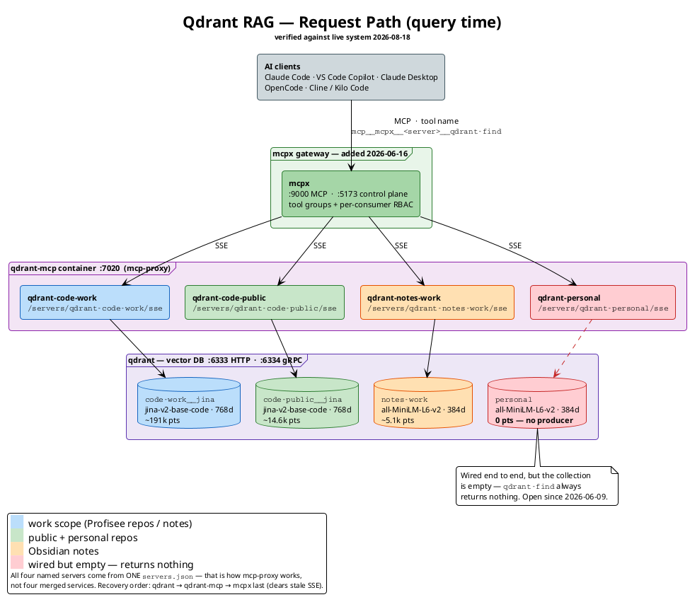
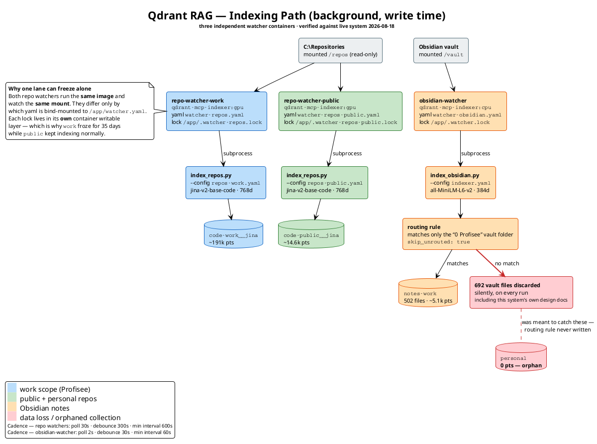

# Qdrant RAG MCP Server

Semantic search over Obsidian vault content and Git repositories via Qdrant vector database, exposed as MCP tools through mcp-proxy SSE endpoints, fronted by the mcpx gateway.

## Architecture

The system has two flows that meet only at the Qdrant collections, so they are drawn
separately: the **request path** (synchronous, read, fan-in through the gateway chain)
and the **indexing path** (asynchronous, write, three fully independent pipelines).
Combining them puts the collections in the middle with edges arriving from both
directions — which is what made the previous single diagram unreadable.

### Request path (query time)


```plantuml
@startuml qdrant-request-path
!theme plain
skinparam backgroundColor white
skinparam roundCorner 8
skinparam defaultFontName "Segoe UI"
skinparam defaultFontSize 11
skinparam shadowing false
skinparam packageStyle frame
skinparam nodesep 22
skinparam ranksep 42
hide stereotype

title Qdrant RAG — Request Path (query time)\n<size:10>verified against live system 2026-08-18</size>

skinparam package {
  BackgroundColor<<clients>> #ECEFF1
  BorderColor<<clients>> #546E7A
  BackgroundColor<<gw>> #E8F5E9
  BorderColor<<gw>> #2E7D32
  BackgroundColor<<mcp>> #F3E5F5
  BorderColor<<mcp>> #8E24AA
  BackgroundColor<<db>> #EDE7F6
  BorderColor<<db>> #5E35B1
}

skinparam rectangle {
  BackgroundColor<<client>> #CFD8DC
  BorderColor<<client>> #455A64
  BackgroundColor<<gwbox>> #A5D6A7
  BorderColor<<gwbox>> #2E7D32
  BackgroundColor<<work>> #BBDEFB
  BorderColor<<work>> #1565C0
  BackgroundColor<<public>> #C8E6C9
  BorderColor<<public>> #2E7D32
  BackgroundColor<<notes>> #FFE0B2
  BorderColor<<notes>> #E65100
  BackgroundColor<<empty>> #FFCDD2
  BorderColor<<empty>> #C62828
}

skinparam database {
  BackgroundColor<<work>> #BBDEFB
  BorderColor<<work>> #1565C0
  BackgroundColor<<public>> #C8E6C9
  BorderColor<<public>> #2E7D32
  BackgroundColor<<notes>> #FFE0B2
  BorderColor<<notes>> #E65100
  BackgroundColor<<empty>> #FFCDD2
  BorderColor<<empty>> #C62828
}

rectangle "**AI clients**\nClaude Code · VS Code Copilot · Claude Desktop\nOpenCode · Cline / Kilo Code" <<client>> as clients

package "mcpx gateway — added 2026-06-16" <<gw>> {
  rectangle "**mcpx**\n:9000 MCP  ·  :5173 control plane\ntool groups + per-consumer RBAC" <<gwbox>> as mcpx
}

package "qdrant-mcp container  :7020  (mcp-proxy)" <<mcp>> {
  rectangle "**qdrant-code-work**\n""/servers/qdrant-code-work/sse""" <<work>> as s_cw
  rectangle "**qdrant-code-public**\n""/servers/qdrant-code-public/sse""" <<public>> as s_cp
  rectangle "**qdrant-notes-work**\n""/servers/qdrant-notes-work/sse""" <<notes>> as s_nw
  rectangle "**qdrant-personal**\n""/servers/qdrant-personal/sse""" <<empty>> as s_pe
  s_cw -[hidden]right- s_cp
  s_cp -[hidden]right- s_nw
  s_nw -[hidden]right- s_pe
}

package "qdrant — vector DB  :6333 HTTP  ·  :6334 gRPC" <<db>> {
  database """code-work__jina""\njina-v2-base-code · 768d\n~191k pts" <<work>> as c_cw
  database """code-public__jina""\njina-v2-base-code · 768d\n~14.6k pts" <<public>> as c_cp
  database """notes-work""\nall-MiniLM-L6-v2 · 384d\n~5.1k pts" <<notes>> as c_nw
  database """personal""\nall-MiniLM-L6-v2 · 384d\n**0 pts — no producer**" <<empty>> as c_pe
  c_cw -[hidden]right- c_cp
  c_cp -[hidden]right- c_nw
  c_nw -[hidden]right- c_pe
}

clients --> mcpx : MCP  ·  tool name\n""mcp__mcpx__<server>__qdrant-find""
mcpx --> s_cw : SSE
mcpx --> s_cp : SSE
mcpx --> s_nw : SSE
mcpx --> s_pe : SSE

s_cw --> c_cw
s_cp --> c_cp
s_nw --> c_nw
s_pe -[#C62828,dashed]-> c_pe

note bottom of c_pe
  Wired end to end, but the collection
  is empty — ""qdrant-find"" always
  returns nothing. Open since 2026-06-09.
end note

legend bottom left
  <back:#BBDEFB>     </back>  work scope (Profisee repos / notes)
  <back:#C8E6C9>     </back>  public + personal repos
  <back:#FFE0B2>     </back>  Obsidian notes
  <back:#FFCDD2>     </back>  wired but empty — returns nothing
  <size:10>All four named servers come from ONE ""servers.json"" — that is how mcp-proxy works,</size>
  <size:10>not four merged services. Recovery order: qdrant → qdrant-mcp → mcpx last (clears stale SSE).</size>
endlegend

@enduml
```

### Indexing path (background, write time)


```plantuml
@startuml qdrant-indexing-path
!theme plain
skinparam backgroundColor white
skinparam roundCorner 8
skinparam defaultFontName "Segoe UI"
skinparam defaultFontSize 11
skinparam shadowing false
skinparam packageStyle frame
skinparam nodesep 24
skinparam ranksep 38
hide stereotype

title Qdrant RAG — Indexing Path (background, write time)\n<size:10>three independent watcher containers · verified against live system 2026-08-18</size>

skinparam rectangle {
  BackgroundColor<<src>> #ECEFF1
  BorderColor<<src>> #546E7A
  BackgroundColor<<work>> #BBDEFB
  BorderColor<<work>> #1565C0
  BackgroundColor<<public>> #C8E6C9
  BorderColor<<public>> #2E7D32
  BackgroundColor<<notes>> #FFE0B2
  BorderColor<<notes>> #E65100
  BackgroundColor<<drop>> #FFCDD2
  BorderColor<<drop>> #C62828
}

skinparam database {
  BackgroundColor<<work>> #BBDEFB
  BorderColor<<work>> #1565C0
  BackgroundColor<<public>> #C8E6C9
  BorderColor<<public>> #2E7D32
  BackgroundColor<<notes>> #FFE0B2
  BorderColor<<notes>> #E65100
  BackgroundColor<<empty>> #FFCDD2
  BorderColor<<empty>> #C62828
}

' ── sources ──────────────────────────────────────────────
rectangle "<b>C:\\Repositories</b>\nmounted ""/repos"" (read-only)" <<src>> as src_repos
rectangle "<b>Obsidian vault</b>\nmounted ""/vault""" <<src>> as src_vault

' ── watchers ─────────────────────────────────────────────
rectangle "<b>repo-watcher-work</b>\n""qdrant-mcp-indexer:gpu""\nyaml ""watcher-repos.yaml""\nlock ""/app/.watcher-repos.lock""" <<work>> as w_work
rectangle "<b>repo-watcher-public</b>\n""qdrant-mcp-indexer:gpu""\nyaml ""watcher-repos-public.yaml""\nlock ""/app/.watcher-repos-public.lock""" <<public>> as w_pub
rectangle "<b>obsidian-watcher</b>\n""qdrant-mcp-indexer:cpu""\nyaml ""watcher-obsidian.yaml""\nlock ""/app/.watcher.lock""" <<notes>> as w_obs

' ── indexers ─────────────────────────────────────────────
rectangle "<b>index_repos.py</b>\n--config ""repos-work.yaml""\njina-v2-base-code · 768d" <<work>> as i_work
rectangle "<b>index_repos.py</b>\n--config ""repos-public.yaml""\njina-v2-base-code · 768d" <<public>> as i_pub
rectangle "<b>index_obsidian.py</b>\n--config ""indexer.yaml""\nall-MiniLM-L6-v2 · 384d" <<notes>> as i_obs

' ── routing gate (the non-obvious part) ──────────────────
rectangle "<b>routing rule</b>\nmatches only the “0 Profisee” vault folder\n""skip_unrouted: true""" <<notes>> as gate

' ── collections ──────────────────────────────────────────
database """code-work__jina""\n~191k pts" <<work>> as c_cw
database """code-public__jina""\n~14.6k pts" <<public>> as c_cp
database """notes-work""\n502 files · ~5.1k pts" <<notes>> as c_nw
database """personal""\n<b>0 pts — orphan</b>" <<empty>> as c_pe

rectangle "<b>692 vault files discarded</b>\nsilently, on every run\n<size:10>including this system's own design docs</size>" <<drop>> as dropped

' ── lane wiring (parallel, no crossings) ─────────────────
src_repos --> w_work
src_repos --> w_pub
src_vault --> w_obs

w_work --> i_work : subprocess
w_pub  --> i_pub  : subprocess
w_obs  --> i_obs  : subprocess

i_work --> c_cw
i_pub  --> c_cp
i_obs  --> gate
gate   --> c_nw : matches
gate  -[#C62828,bold]-> dropped : no match

' personal is an orphan: nothing writes to it. Non-directional link on purpose.
dropped -[#C62828,dashed]- c_pe : was meant to catch these —\nrouting rule never written

' ── layout anchors ───────────────────────────────────────
src_repos -[hidden]right- src_vault
w_work -[hidden]right- w_pub
w_pub  -[hidden]right- w_obs
c_cw -[hidden]right- c_cp

note left of w_work
  <b>Why one lane can freeze alone</b>
  Both repo watchers run the <b>same image</b> and
  watch the <b>same mount</b>. They differ only by
  which yaml is bind-mounted to ""/app/watcher.yaml"".
  Each lock lives in its <b>own</b> container writable
  layer — which is why ""work"" froze for 35 days
  while ""public"" kept indexing normally.
end note

legend bottom left
  <back:#BBDEFB>     </back>  work scope (Profisee)
  <back:#C8E6C9>     </back>  public + personal repos
  <back:#FFE0B2>     </back>  Obsidian notes
  <back:#FFCDD2>     </back>  data loss / orphaned collection
  <size:10>Cadence — repo watchers: poll 30s · debounce 300s · min interval 600s</size>
  <size:10>Cadence — obsidian-watcher: poll 2s · debounce 30s · min interval 60s</size>
endlegend

@enduml
```

## Components

### Qdrant DB

Vector database running in Docker.

```bash
docker run -d --name qdrant \
  -p 6333:6333 -p 6334:6334 \
  -v ~/qdrant_storage:/qdrant/storage \
  qdrant/qdrant
```

### qdrant-mcp Container

Standalone Debian-based container (`python:3.12-slim`) running `mcp-proxy` + `mcp-server-qdrant`. Debian is required because `onnxruntime` (dependency of `fastembed`) has no wheels for Alpine Linux on ARM.

- **Port:** 7020
- **Embedding model:** set **per named server**, not globally — code collections use `jinaai/jina-embeddings-v2-base-code` (768d), notes collections use `sentence-transformers/all-MiniLM-L6-v2` (384d). See the table below.
- **Vector name:** derived from the model by mcp-server-qdrant's FastEmbed provider — `fast-jina-embeddings-v2-base-code` or `fast-all-minilm-l6-v2`.
- **Named servers:** Configured in `servers.json` — one entry per Qdrant collection. The container exposes each as an SSE endpoint at `/servers/<name>/sse`.

> **One container, many servers.** mcp-proxy hosts *N* MCP servers from a single
> `servers.json`, each on its own SSE path. Four collections served by one container is
> how mcp-proxy is designed to work — it is not four services that were merged.

#### Collections (verified live 2026-08-18)

| Named server | Collection | Content | Embedding model | Dims | Points |
|---|---|---|---|---|---|
| `qdrant-code-work` | `code-work__jina` | Profisee canonical repos | `jina-embeddings-v2-base-code` | 768 | ~191k |
| `qdrant-code-public` | `code-public__jina` | bobthearsonist personal repos | `jina-embeddings-v2-base-code` | 768 | ~14.6k |
| `qdrant-notes-work` | `notes-work` | Obsidian vault, **only** `0 Profisee` | `all-MiniLM-L6-v2` | 384 | ~5.1k |
| `qdrant-personal` | `personal` | — | `all-MiniLM-L6-v2` | 384 | **0 — empty** |

The `personal` collection is wired end to end (server entry, SSE endpoint, MCP tools) but
**no routing rule feeds it**, so `qdrant-find` against it always returns nothing. Open
decision since 2026-06-09 — see [The unrouted-vault gap](#the-unrouted-vault-gap).

> **Removed 2026-08-18:** the bare `code-work` and `code-public` collections (MiniLM 384d,
> ~757k points, 1.9 GB) were deleted after the migration to the Jina code model left them
> orphaned. Qdrant storage went 2.9 GB → 1017 MB. Older docs and diagrams that show them
> are stale.

Each collection gets its own entry in `servers.json` (separate SSE endpoint), and is populated by an indexer config (`indexer.yaml` for notes, one `repos-*.yaml` per scope for code).

#### Setup

```bash
# Copy example config and customize for your machine
cp servers.json.example servers.json
# Edit servers.json — declare one entry per collection you want exposed

# Build and start
docker compose up -d --build

# Rebuild after config changes
docker compose up -d --build && docker compose restart
```

### Indexer

Python script that walks the Obsidian vault, chunks markdown files, generates embeddings, and upserts to Qdrant.

Location: `indexer/index_obsidian.py`

#### Setup

```bash
cd indexer

# Copy example config and customize for your machine
cp indexer.yaml.example indexer.yaml
# Edit indexer.yaml:
#   - vault_path comes from ~/ai/local.yaml (machine-specific) — not in this file
#   - Define one or more `collections:` and `routing:` rules to map vault folders to collections
#   - Set skip_unrouted: true to ignore files outside any routing rule (e.g., work-only machine)

# Create virtual environment
python3 -m venv .venv
source .venv/bin/activate  # Linux/Mac
# .venv\Scripts\activate   # Windows

pip install -r requirements.txt
```

#### Usage

```bash
cd indexer
source .venv/bin/activate

# Index using config file (recommended)
python index_obsidian.py --config indexer.yaml

# Incremental index (skips unchanged files)
python index_obsidian.py --config indexer.yaml

# Full re-index
python index_obsidian.py --config indexer.yaml --force

# Preview without writing
python index_obsidian.py --config indexer.yaml --dry-run
```

#### Configuration (indexer.yaml)

See `indexer.yaml.example` for all options. Key settings:

| Setting | Description |
|---|---|
| `vault_path` | Path to Obsidian vault (machine-specific) |
| `collections` | List of Qdrant collections to use |
| `routing` | Maps folder patterns to collections |
| `skip_unrouted` | `true` = skip unmatched files, `false` = use default_collection |
| `skip_dirs` | Folders to ignore entirely |

#### How It Works

1. Reads config from `indexer.yaml` (or command-line `--config`)
2. Walks vault for `.md` files, skipping excluded directories
3. Routes files to collections based on `routing` rules
4. Skips unchanged files (tracked via `.index_state.json`)
5. Chunks by markdown headers (H1-H3), falls back to paragraph splitting, max ~800 chars
6. Prepends document title to each chunk for better embedding context
7. Uses `passage_embed` (not `embed` or `query_embed`) to match MCP server behavior
8. Upserts with named vector `fast-all-minilm-l6-v2` and metadata payload
9. Cleans up points for deleted files

#### The unrouted-vault gap

**Known gap, not a bug — but it loses data silently.** The live `indexer.yaml` on this
machine routes exactly one folder:

```yaml
collections:
  - notes-work
routing:
  notes-work:
    - "0 Profisee"
skip_unrouted: true
```

Everything outside `"0 Profisee"` matches no rule, and `skip_unrouted: true` drops it
without logging a warning. Measured against the live vault on 2026-08-18, applying the
configured `skip_dirs`:

| | Files |
|---|---|
| Routed into `notes-work` | 502 |
| **Silently discarded, every run** | **692** |
| Total `.md` in vault | 1194 |

More than half the vault is invisible to semantic search — including the folder holding
this system's own design documents. So an agent asking "how does the qdrant stack work?"
cannot find the notes that answer it.

The `personal` collection was created to catch this content. **A routing rule for it was
never written**, which is why it sits at 0 points. Closing the gap means either adding a
routing rule that maps the remaining folders to `personal`, or setting
`skip_unrouted: false` with a `default_collection`. Open decision since 2026-06-09 —
it is a deliberate scope choice on a work machine, not an oversight to silently "fix".

#### First-Time Setup

```bash
cd indexer
python3 -m venv .venv
source .venv/bin/activate
pip install -r requirements.txt
cp indexer.yaml.example indexer.yaml
# Edit indexer.yaml with your vault path and preferences
python index_obsidian.py --config indexer.yaml
```

## Client Configuration

**Current topology (since 2026-06-16): clients go through the mcpx gateway, not to port 7020 directly.**

```
AI client  ->  mcpx (gateway)  ->  qdrant-mcp (mcp-proxy :7020)  ->  qdrant (:6333 / :6334)
```

mcpx is registered against each named server at
`http://host.docker.internal:7020/servers/{name}/sse` (see `mcps/mcpx/mcp.json`), and
clients then see the tools under the `mcpx` namespace. Configure qdrant on the **gateway**,
not per client.

The direct-to-7020 configurations below are retained for the bypass case only — debugging
qdrant-mcp in isolation, or a client that cannot reach the gateway. Each named server has
its own endpoint at `http://localhost:7020/servers/{name}/sse`; substitute a real server
name (`qdrant-code-work`, `qdrant-code-public`, `qdrant-notes-work`, `qdrant-personal`).

### VS Code / GitHub Copilot (`mcp.json`) — direct, bypass only

```json
{
  "servers": {
    "qdrant-notes-work": {
      "command": "npx",
      "args": ["--prefer-online", "-y", "mcp-remote", "http://localhost:7020/servers/qdrant-notes-work/sse"]
    },
    "qdrant-code-work": {
      "command": "npx",
      "args": ["--prefer-online", "-y", "mcp-remote", "http://localhost:7020/servers/qdrant-code-work/sse"]
    }
  }
}
```

Config location: `%APPDATA%\Code\User\mcp.json` (Windows) or `~/Library/Application Support/Code/User/mcp.json` (macOS)

### Claude Desktop (`claude_desktop_config.json`)

```json
{
  "mcpServers": {
    "qdrant-notes-work": {
      "command": "npx.cmd",
      "args": ["-y", "mcp-remote", "http://localhost:7020/servers/qdrant-notes-work/sse"]
    }
  }
}
```

Uses `npx.cmd` on Windows (not `npx`). Config location: `%APPDATA%\Claude\claude_desktop_config.json` (Windows) or `~/Library/Application Support/Claude/claude_desktop_config.json` (macOS).

### Claude Code (`settings.local.json`)

Claude Code discovers MCP servers from `~/.claude/.mcp.json` or project-level `.mcp.json`. Enable them in `~/.claude/settings.local.json`:

```json
{
  "enabledMcpjsonServers": ["qdrant-notes-work", "qdrant-code-work"]
}
```

### OpenCode (`opencode.json`)

OpenCode supports SSE natively — no `mcp-remote` bridge needed:

```json
{
  "mcpServers": {
    "qdrant-notes-work": {
      "type": "remote",
      "url": "http://localhost:7020/servers/qdrant-notes-work/sse",
      "enabled": true
    }
  }
}
```

Config location: `.config/opencode/opencode.json` (user-level) or `opencode.json` (project-level).

### Cline / Kilo Code (`mcp_settings.json`)

```json
{
  "mcpServers": {
    "qdrant-notes-work": {
      "command": "npx",
      "args": ["-y", "mcp-remote", "http://localhost:7020/servers/qdrant-notes-work/sse"]
    }
  }
}
```

Config locations:
- **Cline (VS Code):** `%APPDATA%\Code\User\globalStorage\saoudrizwan.claude-dev\settings\cline_mcp_settings.json`
- **Cline (Standalone):** `~/.cline/data/settings/cline_mcp_settings.json`
- **Kilo Code:** `%APPDATA%\Code\User\globalStorage\kilocode.kilo-code\settings\mcp_settings.json`

### Permissions

Add qdrant tools to auto-approve in `~/ai/permissions/permissions.yaml`. Tool names vary by client — use the `find` and `store` operations for each server.

## MCP Tools

Each named server exposes two operations — 4 servers x 2 = **8 tools total**:

| Operation | Description |
|---|---|
| `qdrant-find` | Semantic search over the collection |
| `qdrant-store` | Store new entries in the collection |

Because clients reach these through mcpx, the gateway name is part of the tool name. What
an agent actually calls today:

```
mcp__mcpx__qdrant-code-work__qdrant-find      mcp__mcpx__qdrant-code-work__qdrant-store
mcp__mcpx__qdrant-code-public__qdrant-find    mcp__mcpx__qdrant-code-public__qdrant-store
mcp__mcpx__qdrant-notes-work__qdrant-find     mcp__mcpx__qdrant-notes-work__qdrant-store
mcp__mcpx__qdrant-personal__qdrant-find       mcp__mcpx__qdrant-personal__qdrant-store
```

`mcp__mcpx__qdrant-personal__qdrant-find` is callable but always returns nothing — the
collection is empty. On a direct (non-gateway) connection the `mcpx` segment is absent
and the shape is client-specific, e.g. `qdrant-code-work_qdrant-find` in Copilot.

## Current State

- **Embedding models:** two in use — `jina-embeddings-v2-base-code` (768d) for the code
  collections, `all-MiniLM-L6-v2` (384d, ~45MB) for notes. Set per named server in
  `servers.json` and per indexer in the yaml configs; the two **must** agree or search
  silently returns garbage.
- **Storage:** ~1017 MB after the 2026-08-18 cleanup (was 2.9 GB).
- Point counts above were read from the live system on 2026-08-18. They vary by machine —
  query Qdrant directly (`curl http://localhost:6333/collections`) for current stats.

### Observability

| What | How |
|---|---|
| mcp-proxy server health | `GET http://localhost:7020/status` → `server_instances` + `api_last_activity` |
| Qdrant collections / points | `GET http://localhost:6333/collections`, or the web UI at `http://localhost:6333/dashboard` |
| Per-server gateway health | `mcpx-mcp-status-1` polls every 30s into its own container logs |

### Recovery order

Start (or restart) in this order — **mcpx last**, so it clears stale SSE sessions against
a backend that is already up:

```
qdrant  ->  qdrant-mcp  ->  mcpx
```

## Repository Indexing

Indexes local Git repositories into one or more code collections for semantic search over codebases.

### Splitting by scope (recommended)

For repositories spanning multiple ownership scopes (e.g., work vs personal), use one config file per scope so queries can target a specific corpus:

| Config (actual) | Collection (actual) | Use case |
|---|---|---|
| `repos-work.yaml` | `code-work__jina` | Employer/team repositories |
| `repos-public.yaml` | `code-public__jina` | Personal / public repositories |

The `__jina` suffix marks the 768d Jina code-embedding generation. The unsuffixed
`code-work` / `code-public` collections were the older 384d MiniLM generation and were
deleted on 2026-08-18.

Each config sets a `qdrant_collection:` field at the top level. The indexer reads this to know where to upsert. Backwards compatible: configs without the field default to a `code` collection (no such collection exists on this machine — both live configs set the field explicitly).

Each config also sets `embedding.model`. **The model in the indexer config and the model in that collection's `servers.json` entry must match** — mismatched models produce vectors of the wrong shape or geometry, and search degrades silently rather than erroring.

A single shared `repos.yaml` is also supported when scope splitting isn't needed.

### Configuration

All repo indexer settings live in `indexer/repos*.yaml` — no code changes needed to add/remove repos or adjust skip patterns.

| Key | Purpose |
|---|---|
| `qdrant_collection` | Destination collection (defaults to `code` for back-compat) |
| `repos_base` | Base directory for repositories (e.g., `~/Repositories`) |
| `repos` | List of repository directory names to index |
| `skip_dirs` | Directories to skip (e.g., `.git`, `node_modules`, `dist`) |
| `skip_files` | Files to skip (e.g., `package-lock.json`, `yarn.lock`) |
| `skip_extensions` | Binary/generated file extensions to skip |
| `index_extensions` | Text file extensions to index |
| `index_filenames` | Specific filenames to always index (e.g., `Dockerfile`, `CLAUDE.md`) |
| `max_chunk_chars` | Maximum chunk size in characters (default: 1200) |

### Chunking Strategy

Code-aware chunking splits by language-specific boundaries:

| Language | Split Pattern |
|---|---|
| Python | `class`, `def`, `async def` |
| TypeScript/JavaScript | `function`, `class`, `const =`, `interface`, `type` |
| Go | `func`, `type` |
| Rust | `fn`, `struct`, `enum`, `impl`, `trait`, `mod` |
| Ruby | `class`, `module`, `def` |
| Shell | Function definitions |
| C#/Java | Class, interface, enum, method declarations |
| Markdown | H1-H3 header boundaries |
| Other text | Paragraph-based fallback, then line-based |

### Usage

```bash
cd indexer
source .venv/bin/activate

# Incremental index (skips unchanged files)
python index_repos.py

# Full re-index
python index_repos.py --force

# Preview without writing
python index_repos.py --dry-run
```

### How It Works

1. Loads configuration from the `--config` yaml (`repos-work.yaml` / `repos-public.yaml`)
2. Walks each repository, respecting skip patterns
3. Skips unchanged files — state is per scope: `.index_repos_state_work.json` /
   `.index_repos_state_public.json` (MD5 hashes), bind-mounted back to the host
4. Detects language from file extension for code-aware chunking
5. Prepends `repo/filepath` context to each chunk for better embeddings
6. Uses `passage_embed` with named vector `fast-jina-embeddings-v2-base-code` (768d) —
   **not** the 384d MiniLM vector the notes indexer uses
7. Upserts with deterministic point IDs: `UUID5(repo::filepath::chunk_index)`
8. Cleans up points for deleted files

### Metadata

Each point stores:

```json
{
  "document": "<chunk content>",
  "metadata": {
    "repo": "ai-infrastructure",
    "file_path": "mcps/qdrant-mcp/indexer/index_obsidian.py",
    "language": "python",
    "chunk_index": 0,
    "total_chunks": 5,
    "collection": "code-work__jina",
    "last_modified": "2026-02-27T..."
  }
}
```

### MCP Tools

Exposes the same `qdrant-find` and `qdrant-store` operations as other collections.

## Watcher Sidecars (auto-reindex)

Long-running sidecar containers that watch filesystem mounts and trigger the indexer subprocess on changes. One sidecar per indexer scope. All three run an `qdrant-mcp-indexer` image (`:cpu` for notes, `:gpu` for code) — the differences are the mounted config and the mount being watched, not the command.

### What's running (verified 2026-08-18)

All three are **independent containers**. Nothing coordinates them; one can fail while the
others keep working.

| Sidecar | Image | Watches | Watcher config | Triggers | Collection |
|---|---|---|---|---|---|
| `repo-watcher-work` | `:gpu` | `/repos` | `watcher-repos.yaml` | `index_repos.py --config /app/repos-work.yaml` | `code-work__jina` |
| `repo-watcher-public` | `:gpu` | `/repos` | `watcher-repos-public.yaml` | `index_repos.py --config /app/repos-public.yaml` | `code-public__jina` |
| `obsidian-watcher` | `:cpu` | `/vault` | `watcher-obsidian.yaml` | `index_obsidian.py --config /app/indexer.yaml` | `notes-work` |

The two repo watchers are the **same image watching the same mount**. What separates them
is which yaml is bind-mounted onto `/app/watcher.yaml` (there is no `REPOS_CONFIG` env var).

### Cadence

Differs between code and notes — code changes arrive in build-sized bursts, note edits do not.

| Sidecar | Poll | Debounce | Min interval |
|---|---|---|---|
| `repo-watcher-work`, `repo-watcher-public` | 30s | 300s | 600s |
| `obsidian-watcher` | 2s | 30s | 60s |

### Why one lane can freeze while the others are fine

Each watcher's lockfile lives in **its own container's writable layer**:

| Sidecar | Lockfile |
|---|---|
| `repo-watcher-work` | `/app/.watcher-repos.lock` |
| `repo-watcher-public` | `/app/.watcher-repos-public.lock` |
| `obsidian-watcher` | `/app/.watcher.lock` |

A stale lock is therefore invisible to the other containers and produces no global symptom.
This is exactly how `code-work__jina` went 35 days without an update while `code-public__jina`
kept indexing normally. When a collection looks stale, check that watcher's lock and logs
specifically — a healthy sibling proves nothing.

Index state, by contrast, **is** bind-mounted back to the host
(`.index_repos_state_work.json`, `.index_repos_state_public.json`, `.index_state.json`),
so it survives container replacement.

Each sidecar config file (`watcher-*.yaml`) defines:
- `watch_path` — where in the container to watch
- `watched_extensions` — file extensions that wake the watcher
- `indexer_cmd` — command to run on debounced trigger
- `debounce_seconds`, `min_interval_seconds`, `poll_interval_seconds`, `idle_only` — tuning knobs
- `lockfile` — distinct per sidecar so concurrent watchers don't fight

### Critical detail: PollingObserver on Windows + Docker

The watcher uses `watchdog.observers.polling.PollingObserver`, not native inotify. Docker Desktop on Windows + WSL2 does not reliably propagate inotify events across the bind-mount boundary — polling is the only thing that actually works on that host topology. On Linux hosts you could swap to the native observer.

### Adding a watcher for a new scope

1. Add a `<name>-watcher` service to `docker-compose.yml` mounting the source path + a yaml config
2. Copy `watcher-obsidian.yaml.example` (CPU/notes) or `watcher-repos.yaml.example` (GPU/code) as the starting schema
3. Point `indexer_cmd` at the corresponding indexer + config
4. `docker compose up -d --build <name>-watcher`

## Future Work

- [x] ~~Automate re-indexing via launchd/cron schedule~~ — done via watcher sidecars (see above)
- [x] ~~Evaluate upgrading to a larger embedding model~~ — code collections migrated to
      `jina-embeddings-v2-base-code` (768d); the superseded 384d collections were deleted 2026-08-18
- [ ] **Decide what feeds `personal`** — 692 vault files are discarded on every run and the
      collection is empty. See [The unrouted-vault gap](#the-unrouted-vault-gap)
- [ ] Evaluate a larger model for **notes** too — `notes-work` is still 384d MiniLM
- [ ] Per-watcher staleness alert — a frozen lane is currently silent (see the lockfile note above)
- [ ] Add AI skills + memory indexing
- [ ] Migrate Qdrant DB to Synology NAS
- [ ] Linux host variant of the watcher using native inotify observer

## Related tools

- **[graphify](https://github.com/safishamsi/graphify)** — complementary to qdrant code collections. Where qdrant code collections answer "find code semantically similar to X," graphify builds a structural call/dependency graph that answers "where is X called from / what's the path between A and B." Lives as a host-side CLI + MCP, separate from this Compose stack. Setup guide (dual-mode workspace + per-repo deployment, auto-rebuild via git hooks): [../../docs/graphify-workspace-setup.md](../../docs/graphify-workspace-setup.md). Use both: qdrant for semantic recall, graphify for structural navigation.


