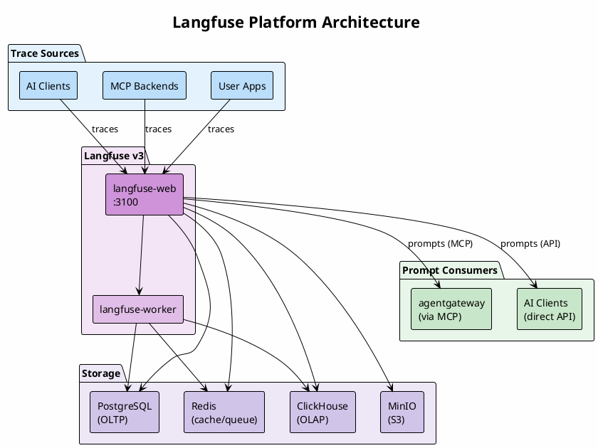
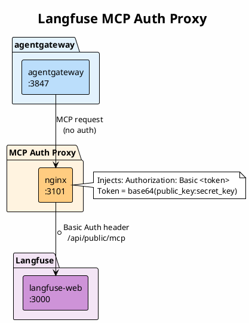

# Langfuse - LLM Observability Platform

Self-hosted Langfuse v3 for tracing, evaluating, and monitoring LLM applications.

## Status

✅ **Available** - Running locally

## Quick Start

```bash
# Start all services
docker compose up -d

# Check status
docker compose ps

# View logs
docker compose logs -f langfuse-web
```

## Access

| Service         | URL                   | Credentials                   |
| --------------- | --------------------- | ----------------------------- |
| **Langfuse UI** | http://localhost:3100 | Create account on first visit |
| MinIO Console   | http://localhost:9191 | minio / miniosecret           |
| PostgreSQL      | localhost:5433        | langfuse / langfuse           |

## Services

| Service | Description |
| ------- | ----------- |
| **LLM Tracing** | Track all LLM calls, chains, and agent actions with detailed logs |
| **Prompt Management** | Version control prompts with production/staging labels |
| **Evaluations** | Score and evaluate LLM outputs (LLM-as-judge, human feedback) |
| **Analytics** | Cost tracking, latency metrics, usage statistics |
| **Datasets** | Create test sets for benchmarking and evaluation |
| **Playground** | Test and iterate on prompts with instant feedback |
| **OpenTelemetry** | Ingest traces via OTel, export internal metrics |

## Architecture

Langfuse has a **bidirectional relationship** with the AI infrastructure:

- **Traces flow IN** from multiple sources via OpenTelemetry or native SDKs
- **Prompts flow OUT** to consumers via MCP or REST API



## Configuration

### Production Setup

1. Copy the example environment file:

   ```bash
   cp .env.example .env
   ```

2. Generate secure secrets:

   ```bash
   # Generate NEXTAUTH_SECRET
   openssl rand -base64 32

   # Generate ENCRYPTION_KEY
   openssl rand -hex 32
   ```

3. Update `.env` with your secrets

4. Restart services:
   ```bash
   docker compose down
   docker compose up -d
   ```

### Headless Initialization

To pre-create an organization, project, and admin user, set these in `.env`:

```bash
LANGFUSE_INIT_ORG_ID=my-org
LANGFUSE_INIT_ORG_NAME=My Organization
LANGFUSE_INIT_PROJECT_ID=my-project
LANGFUSE_INIT_PROJECT_NAME=My Project
LANGFUSE_INIT_PROJECT_PUBLIC_KEY=pk-lf-your-public-key
LANGFUSE_INIT_PROJECT_SECRET_KEY=sk-lf-your-secret-key
LANGFUSE_INIT_USER_EMAIL=admin@example.com
LANGFUSE_INIT_USER_NAME=Admin
LANGFUSE_INIT_USER_PASSWORD=your-secure-password
```

## Integration with AI Infrastructure

Langfuse is connected to the `mcpx_ai-infrastructure` Docker network, allowing other services to send traces.

### Getting API Keys

1. Open http://localhost:3100
2. Create an account or login
3. Go to Settings → API Keys
4. Create a new API key pair (public + secret)

### Using with agentgateway

Add Langfuse tracing to agentgateway by setting environment variables:

```yaml
# In gateways/agentgateway/docker-compose.yml
environment:
  LANGFUSE_PUBLIC_KEY: pk-lf-xxx
  LANGFUSE_SECRET_KEY: sk-lf-xxx
  LANGFUSE_HOST: http://langfuse-web:3000
```

### SDK Integration

```python
# Python
from langfuse import Langfuse

langfuse = Langfuse(
    public_key="pk-lf-...",
    secret_key="sk-lf-...",
    host="http://localhost:3100"
)

# Create a trace
trace = langfuse.trace(name="my-llm-call")
```

```typescript
// TypeScript
import { Langfuse } from 'langfuse';

const langfuse = new Langfuse({
  publicKey: 'pk-lf-...',
  secretKey: 'sk-lf-...',
  baseUrl: 'http://localhost:3100',
});
```

## Ports Used

| Port | Service           | Description                               |
| ---- | ----------------- | ----------------------------------------- |
| 3100 | langfuse-web      | Main UI (avoids Grafana conflict on 3000) |
| 3101 | mcp-auth-proxy    | MCP endpoint with auth (for agentgateway) |
| 9190 | langfuse-minio    | MinIO S3 API                              |
| 9191 | langfuse-minio    | MinIO Console                             |
| 5433 | langfuse-postgres | PostgreSQL (localhost only)               |

## Containers

Langfuse v3 runs as 6 containers plus an auth proxy:

| Container | Image | Port | Purpose |
| --------- | ----- | ---- | ------- |
| langfuse-web | `langfuse/langfuse:3` | 3100 | Web UI + APIs |
| langfuse-worker | `langfuse/langfuse-worker:3` | - | Async event processing |
| mcp-auth-proxy | `nginx` | 3101 | Adds Basic Auth for MCP endpoint |
| langfuse-postgres | `postgres:16` | 5433 | Transactional database |
| langfuse-clickhouse | `clickhouse/clickhouse-server:24` | 8123 | OLAP for traces/analytics |
| langfuse-redis | `redis:7` | 6379 | Queue + cache |
| langfuse-minio | `minio/minio` | 9190/9191 | S3-compatible blob storage |

## MCP Auth Proxy

Langfuse exposes an MCP endpoint at `/api/public/mcp` that requires Basic Auth. The `mcp-auth-proxy` (nginx) injects the auth header so agentgateway can connect without client-side auth configuration.



**Why the proxy?**

| Without Proxy | With Proxy |
| ------------- | ---------- |
| agentgateway must send auth headers | Auth handled server-side |
| Credentials in agentgateway config | Credentials in langfuse config |
| Each client needs auth setup | Single point of auth |

Configuration is in `mcp-auth-proxy.conf`. Set `LANGFUSE_AUTH_TOKEN` in `.env`.

## Data Persistence

Data is stored in Docker volumes:

- `langfuse_postgres_data` - PostgreSQL data
- `langfuse_clickhouse_data` - ClickHouse analytics data
- `langfuse_clickhouse_logs` - ClickHouse logs
- `langfuse_minio_data` - MinIO blob storage

### Backup

```bash
# Backup PostgreSQL
docker exec langfuse-postgres pg_dump -U langfuse langfuse > backup.sql

# Backup volumes
docker run --rm -v langfuse_postgres_data:/data -v $(pwd):/backup alpine tar czf /backup/postgres_data.tar.gz /data
```

## Troubleshooting

### Services not starting

```bash
# Check logs
docker compose logs langfuse-web
docker compose logs langfuse-worker

# Check health
docker compose ps
```

### Database connection issues

```bash
# Verify PostgreSQL is running
docker exec langfuse-postgres pg_isready -U langfuse
```

### Reset everything

```bash
docker compose down -v  # Warning: deletes all data
docker compose up -d
```

## References

- [Langfuse Documentation](https://langfuse.com/docs)
- [Self-Hosting Guide](https://langfuse.com/self-hosting)
- [MCP Server](https://github.com/langfuse/mcp-server-langfuse)
- [API Reference](https://langfuse.com/docs/api)
- [Python SDK](https://langfuse.com/docs/sdk/python)
- [TypeScript SDK](https://langfuse.com/docs/sdk/typescript)
