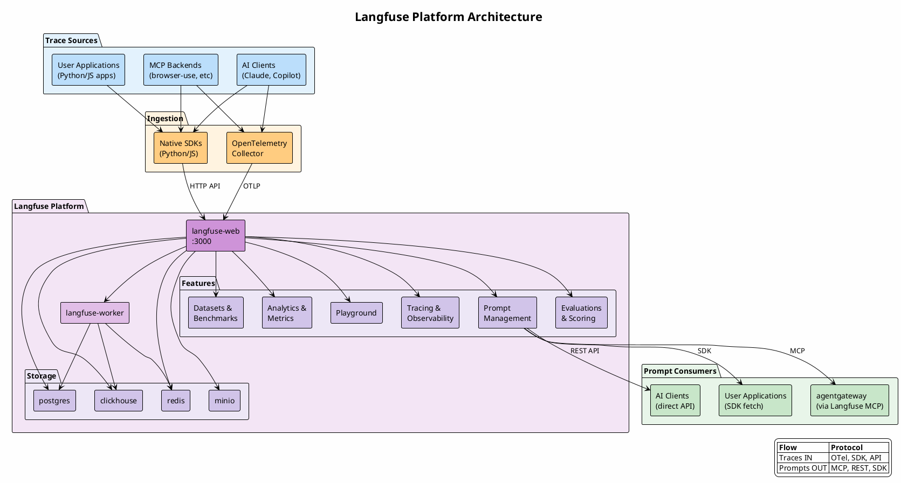

# Langfuse

[Langfuse](https://langfuse.com) is an open-source LLM engineering platform for observability, prompt management, and evaluation. It can be self-hosted alongside agentgateway to provide a complete LLMOps solution.

## Status

⏳ **Planned** - Not yet deployed

## Services

| Service | Description |
| ------- | ----------- |
| **LLM Tracing** | Track all LLM calls, chains, and agent actions with detailed logs |
| **Prompt Management** | Version control prompts with production/staging labels |
| **Evaluations** | Score and evaluate LLM outputs (LLM-as-judge, human feedback) |
| **Analytics** | Cost tracking, latency metrics, usage statistics |
| **Datasets** | Create test sets for benchmarking and evaluation |
| **Playground** | Test and iterate on prompts with instant feedback |
| **OpenTelemetry** | Ingest traces via OTel, export internal metrics |

## Containers

Langfuse v3 runs as 6 containers:

| Container | Image | Port | Purpose |
| --------- | ----- | ---- | ------- |
| langfuse-web | `langfuse/langfuse:latest` | 3000 | Web UI + APIs |
| langfuse-worker | `langfuse/langfuse-worker:latest` | - | Async event processing |
| postgres | `postgres:16` | 5432 | Transactional database |
| clickhouse | `clickhouse/clickhouse-server:24` | 8123 | OLAP for traces/analytics |
| redis | `redis:7` | 6379 | Queue + cache |
| minio | `minio/minio` | 9001 | S3-compatible blob storage |

## Architecture

Langfuse has a **bidirectional relationship** with the AI infrastructure:

- **Traces flow IN** from multiple sources via OpenTelemetry or native SDKs
- **Prompts flow OUT** to consumers via MCP or REST API



## Integration Points

| Direction | Source/Target | Protocol | Description |
| --------- | ------------- | -------- | ----------- |
| **IN** | AI Clients | SDK/OTel | Traces from Claude, Copilot, etc (if instrumented) |
| **IN** | MCP Backends | SDK/OTel | Traces from browser-use, playwright, etc |
| **IN** | User Apps | SDK/OTel | Traces from custom Python/JS applications |
| **OUT** | agentgateway | MCP | Prompts served via Langfuse MCP server |
| **OUT** | AI Clients | REST API | Direct prompt fetching |
| **OUT** | User Apps | SDK | Prompt retrieval with caching |

## Integration with agentgateway

Langfuse MCP server exposes prompts that can be consumed by agentgateway:

```yaml
# agentgateway config.yaml
backends:
  mcp:
    targets:
      - name: langfuse-mcp
        sse:
          host: http://host.docker.internal:7012/sse
```

## Setup

### Quick Start (Docker Compose)

```bash
# Clone Langfuse
git clone https://github.com/langfuse/langfuse.git
cd langfuse

# Start all containers
docker compose up -d
```

Access the UI at `http://localhost:3000`

### Environment Variables

```bash
# Required for Langfuse
NEXTAUTH_SECRET=<generate-secure-secret>
SALT=<generate-secure-salt>
NEXTAUTH_URL=http://localhost:3000

# For Langfuse MCP Server (to expose prompts)
LANGFUSE_PUBLIC_KEY=pk-lf-xxx
LANGFUSE_SECRET_KEY=sk-lf-xxx
LANGFUSE_HOST=http://localhost:3000
```

### Generate Secrets

```bash
# Generate NEXTAUTH_SECRET
openssl rand -base64 32

# Generate SALT
openssl rand -base64 32
```

## Langfuse MCP Server

To expose Langfuse prompts via MCP:

```bash
# Install
npm install -g @langfuse/mcp-server-langfuse

# Run (stdio mode for mcp-proxy)
npx @langfuse/mcp-server-langfuse
```

Or add to stdio-proxy `servers.json`:

```json
{
  "langfuse": {
    "command": "npx",
    "args": ["@langfuse/mcp-server-langfuse"],
    "env": {
      "LANGFUSE_PUBLIC_KEY": "pk-lf-xxx",
      "LANGFUSE_SECRET_KEY": "sk-lf-xxx",
      "LANGFUSE_HOST": "http://langfuse-web:3000"
    }
  }
}
```

### MCP Tools Provided

| Tool | Description |
| ---- | ----------- |
| `langfuse_get_prompt` | Fetch a prompt by name, version, or label |
| `langfuse_list_prompts` | List all prompts with optional filtering |

## Migration to Compute Node

1. **Local dev**: Run docker compose as above
2. **Compute node**: Copy docker-compose.yml, update:
   - `NEXTAUTH_URL` to your node's URL
   - Generate new secure secrets
   - Configure external Postgres/Redis if desired
3. **Production**: Consider Kubernetes (Helm chart available)

## Resources

- [Langfuse Documentation](https://langfuse.com/docs)
- [Self-Hosting Guide](https://langfuse.com/self-hosting)
- [MCP Server](https://github.com/langfuse/mcp-server-langfuse)
- [GitHub Repository](https://github.com/langfuse/langfuse)

## TODO

- [ ] Create docker-compose.yml for local deployment
- [ ] Configure Langfuse MCP server in stdio-proxy
- [ ] Add to agentgateway config
- [ ] Set up OpenTelemetry collector for trace ingestion
- [ ] Configure prompt workflows
